# Agent-Precision

An LLM orchestrator that rewrites numerical kernels (Kokkos, CUDA, HIP,
SYCL, and OpenMP-offload) to use less floating-point storage where it is
safe to do so, given a user-stated tolerance on the kernel's output
precision.

**Why precision matters for throughput.** Modern GPUs accelerate `float`
much more than `double` (and accelerate narrower-than-`float` types more
still), while `double` performance has stagnated. Most scientific kernels
are written in `double` out of habit, not need: their inputs and outputs
don't carry enough significant figures to justify it. The cost of that
habit is throughput. This tool's job is to find the per-variable storage
type that satisfies the user's output-precision tolerance and no more.

This is a research prototype and a deliberate learning exercise in agent
orchestration and tool-calling. It is a single Python package (`workflow/`)
that talks to the Anthropic SDK. There is no build system and no CI. A
small Layer 1 test suite (`tests/`, run with `python -m pytest -q`) covers
the workflow plumbing with monkeypatched API calls; a Layer 2 harness
(`evals/layer2/`) grades agent judgment end-to-end over the 17-kernel
`test-kernels/` corpus. Features are added in small, observable steps
rather than as end-to-end machinery.

If you want to hack on the workflow itself, read `AGENTS.md` first — it
contains the gotchas (model id, env-loading, backend quirks) that will
otherwise burn you.

## Precision vocabulary

Three things this project keeps deliberately separate:

- **`sig_figs`** — *relative* tolerance on the kernel's output (`--sig-figs 6` ≈ relative error below `1e-6`).
- **`decimal_digits`** — *absolute* tolerance on the output (`--decimal-digits 4` ≈ absolute error below `1e-4`).
- **Storage precision** (`float`, `double`, `float-float`, …) — how wide a variable is in memory. A kernel can hit a sig-figs target using a *mix* of storage precisions; that mix is what the analyst chooses.

Tolerance is the **target**; storage precision is the **mechanism**.
Full plumbing details (the `{kind, value, source}` dict, the `source`
enum, how it flows through prompts) live in `AGENTS.md` under "Tolerance
vocabulary and plumbing".

## Status

What works today:

- Core pipeline `analyst → rewriter → verifier`. `finish` is gated in **code** (not just in the system prompt) on the most recent `spawn_verifier` returning `verdict='accept'`; on a Kokkos `.cpp` input, `finish` additionally requires the most recent `compare_outputs` to have returned `status='ok'` for the current rewrite cycle. A premature `finish` is turned into a synthetic `{status:'error', is_error:true}` tool result naming what's missing, so the orchestrator can self-correct without exiting.
- Dynamic verification chain (any profile whose `LanguageProfile.dynamic_verification` is `True` — currently all five): **harness → compile → run → splice → compile_rewritten → run_rewritten → compare_outputs → measure_speedup**, ending in a tolerance check that gates `finish` plus a non-gating wall-clock measurement. The five LLM agents are reused as-is; the seven deterministic (non-LLM) tools in `workflow/tools.py` (`compile_baseline_driver`, `run_baseline_driver`, `splice_rewritten_kernel`, `compile_rewritten_driver`, `run_rewritten_driver`, `compare_outputs`, `measure_speedup`) all return the uniform `{status, stdout, stderr, artifacts}` shape. `measure_speedup` runs after a passing comparator, reads the top-level `timing` block that the baseline harness emits into every `reference.json` (11 trials: 1 untimed warmup + 10 timed, `%.9g` formatting), computes `speedup = baseline_mean / rewritten_mean` with ratio error propagation, and writes `baselines/<kernel_stem>/rewritten/timing.json` on the ok path only. It is deliberately **non-gating**: a missing `timing` block, a subprocess timeout, or a slowdown all surface as tool output without blocking `finish`. `baseline_harness` writes `baselines/<kernel_stem>/<driver_filename>` (`.cpp` for Kokkos/SYCL/OpenMP-offload, `.cu` for CUDA, `.hip` for HIP); the baseline compile/run trio produces `baselines/<kernel_stem>/{driver, reference.json}`; the rewritten chain (splice → compile_rewritten → run_rewritten) produces `baselines/<kernel_stem>/rewritten/{driver.<ext>, driver, reference.json}` from the rewriter's output without ever touching the baseline tree; `compare_outputs` diffs the two `reference.json` files under the same `tolerance_json` that was passed to `spawn_verifier` and writes `baselines/<kernel_stem>/rewritten/comparison.json` on both pass and fail paths. Kokkos is smoke-validated end-to-end; CUDA is smoke-validated through the comparator step (on `vector_add.cu --sig-figs 6 --auto`); HIP, SYCL, and OpenMP-offload ship unit-tested only — no host with the respective toolchain (`hipcc`, `icpx`/`clang++ -fsycl`, `clang++ -fopenmp -fopenmp-targets=...`) was available at implementation time.
- Probe pipeline (any profile whose `LanguageProfile.probe_precisions` is non-empty — currently Kokkos only): a pre-analyst empirical sweep that runs the kernel under 4 precisions (`quad`, `double`, `float`, `mixed_io`) × 2 RNG seeds (`{42, 43}`) and feeds the per-output statistics into the analyst's task as a descriptive evidence block (no verdict hints — see `_format_probe_evidence_for_analyst` in `orchestrator.py`). Two new deterministic tools in `workflow/tools.py` — `probe_step` (fused compile+run per cell; 8 calls per Kokkos kernel) and `probe_compare` (aggregates the 8 references against `quad_seed42` ground truth) — both return the same `{status, stdout, stderr, artifacts}` shape as the dynamic-verification tools and write under `baselines/<kernel_stem>/probe/`. Probe failures are non-fatal: only a missing `quad_seed42` cell hard-errors; every other per-cell error is reported by `probe_compare` and the analyst still runs. Opt out with `--no-probe`; CUDA / HIP / SYCL / OMP-offload silently skip the probe regardless. See `AGENTS.md` ("Probe pipeline") for the contract.
- Tolerance from `--sig-figs` / `--decimal-digits` — exactly one is REQUIRED (argparse rejects a run with neither, exit code 2). The prior optional-flag contract paired with a `precision_advisor` LLM was removed to eliminate silent per-kernel tolerance drift; the dict flowing through the pipeline is now always `{kind, value, source:'user_cli'}`.
- Tolerance threaded verbatim to analyst, rewriter, and verifier; analyst returns a `precision_budget` block; verifier audits it.
- Per-variable methods: `downcast` (narrower hardware type — the throughput win), `emulate` (software pair, currently inline float-float / Dekker — throughput-NEGATIVE; only when downcast violates tolerance), or `keep`. Analyst can additionally suggest a kernel-shape `rework` such as Kahan summation.
- HITL pause before every agent call (`y` / `n` / `q`); rejection feeds `{"status": "rejected_by_user"}` back so the orchestrator can self-correct. `--auto` skips the pause for batch runs and writes a JSONL trace of every executed tool to `baselines/<kernel_stem>/orchestrator_trace.jsonl`.
- Optional **pinned test inputs** via a sibling `<kernel_file>.testconfig.json` file (freeform JSON object; auto-loaded by `workflow/run.py`, threaded verbatim into the baseline_harness's task as a `TEST CONFIG (JSON):` block). Motivated by consistency sweeps where the harness picked wildly different N / RNG-seed / scalar-parameter combinations across attempts; a malformed or non-object config is a hard CLI error so the operator can't silently drift back to "harness invents inputs". Only the Kokkos harness prompt currently consumes the block in v0. See "Run" for usage.
- Optional **analyst self-consistency ensemble**: opt-in via `AGENT_PRECISION_ANALYST_K > 1` (with diversity temperature `AGENT_PRECISION_ANALYST_T`, default `0.7`). Runs the analyst K times in parallel and folds the verdicts through `workflow/aggregator.py` — per-variable plurality with `keep > emulate > downcast` conservative tiebreak, strict-majority rework vote, budget+notes from the most-aligned verdict. Default `K=1` preserves the existing single-shot behavior.
- Optional **verifier perspective-diverse panel**: opt-in via `AGENT_PRECISION_VERIFIER_K > 1` (with `AGENT_PRECISION_VERIFIER_T`, default `0.7`). Runs the verifier K times in parallel under K distinct lenses (faithfulness → budget → edge_cases; defined in `workflow/verifier_panel.py:VERIFIER_LENSES`) and folds the results through `aggregate_verifier_verdicts` — strict-accept (any dissent flips to reject), per-variable owned by the faithfulness lens, concerns unioned and prefixed with `[<lens>]` for richer rewriter-retry feedback. `K` is capped at the number of defined lenses.
- Registry-driven agent definitions: one entry in `workflow/registry.py` per agent type; the generic runner is untouched.
- Three execution backends: direct `api.anthropic.com`, Argo via local `argo-proxy`, and Argo via SSH tunnel + shim (fallback).

What is intentionally **not** here yet:

- The `verifier` agent itself remains a **static / textual** check on faithfulness of code to verdict; mechanical verification of the rewritten kernel is now done by the `compare_outputs` tool downstream of it (not by the verifier agent). Throughput is measured by the non-gating `measure_speedup` tool that runs after `compare_outputs='ok'`; it reads the harness-emitted `timing` block and reports a wall-clock speedup with propagated stddev, but never blocks `finish`.
- End-to-end smoke validation for HIP, SYCL, and OpenMP-offload (the relevant toolchains were not available on the development host). All three are exercised by the unit tests in `tests/test_tools.py` / `tests/test_registry.py` / `tests/test_languages.py` but no real kernel in each language has been driven through the full chain yet.
- No framework (LangGraph etc.). See "Design notes" and "Roadmap".

## Run

Only dependency: `anthropic>=0.40.0`.

```bash
pip install -r requirements.txt
```

Stdout in every mode is the orchestrator's reasoning, then a HITL prompt
for each proposed tool call, then the final rewritten kernel and notes.

**Tolerance flags (REQUIRED, mutually exclusive).** Exactly one of
`--sig-figs` / `--decimal-digits` must be given; running with neither
is an argparse error (exit 2). Both Argo wrapper scripts forward all
extra arguments to `python -m workflow.run`.

```text
--sig-figs N         relative tolerance: ~N significant figures of agreement
--decimal-digits N   absolute tolerance: ~N decimal places of agreement
--auto               skip the HITL pause; write JSONL trace to
                     baselines/<kernel_stem>/orchestrator_trace.jsonl
```

**Optional ensemble env vars** (default behavior is unchanged when unset):

```text
AGENT_PRECISION_ANALYST_K=N    run analyst N times in parallel and aggregate
AGENT_PRECISION_ANALYST_T=F    sampling temperature for the analyst ensemble (default 0.7)
AGENT_PRECISION_VERIFIER_K=N   run verifier under N distinct lenses (N <= 3)
AGENT_PRECISION_VERIFIER_T=F   sampling temperature for the verifier panel (default 0.7)
```

**Pinning baseline harness inputs** (`<kernel>.testconfig.json`
side-channel). By default the baseline_harness agent invents the
kernel's test inputs — N, RNG seed, scalar parameters, per-array
distributions / ranges — and inconsistent choices across runs make
probe evidence and comparator results non-comparable. To pin them,
drop a `<kernel_file>.testconfig.json` file next to the kernel
source; `workflow/run.py` auto-loads it and threads the parsed JSON
into the initial user message as a `TEST CONFIG (JSON):` block that
the Kokkos harness prompt reads verbatim. No CLI flag governs this
— the presence of the sibling file is the opt-in. The schema is
freeform JSON (the harness prompt describes conventional keys per
kernel) but the top-level value MUST be a JSON object; a list,
scalar, or malformed JSON is a hard CLI error rather than a silent
fallback, so the operator can't silently drift into "harness
invents inputs" territory. Example:
`test-kernels/kokkos/mixed/nbody_force.cpp.testconfig.json` pins
`N=1024, seed=42, eps=0.05, dt=0.01` plus uniform position /
velocity / mass ranges. Only the Kokkos harness prompt documents
key semantics in v0 — the four other v0 profiles will still receive
the block if a config file is present, but their harnesses have no
contract for consuming it, so do not drop `.testconfig.json` files
next to non-Kokkos kernels yet.

**Direct (Anthropic API).** `.env` is not auto-loaded.

```bash
set -a; source .env; set +a            # exports ANTHROPIC_API_KEY etc.
python -m workflow.run test-kernels/kokkos/mixed/nbody_force.cpp --sig-figs 6
```

**Argo via local `argo-proxy` (recommended on Argonne hosts).** Requires
`argo-proxy serve` already running; no per-session Duo prompt.

```bash
./scripts/run-argoproxy.sh test-kernels/kokkos/mixed/nbody_force.cpp --decimal-digits 4
```

**Argo via SSH tunnel + shim (fallback).** Use when `argo-proxy` is not
installed on this host.

```bash
./scripts/run-argo.sh test-kernels/kokkos/mixed/nbody_force.cpp
```

See `AGENTS.md` for backend details (ports, model-id quirks, why both
Argo paths exist).

## Workflow

Intended happy path through the orchestrator for a Kokkos `.cpp`
input with a tolerance flag (`--sig-figs N` or `--decimal-digits N`)
and the full dynamic-verification + probe chain running. Step 6 is
itself a six-stage subgraph — the per-variable analyst pipeline (see
`flowchart.md` for the full expansion). The same shape applies to
CUDA, HIP, SYCL, and OpenMP-offload — only steps 4–5 (`probe_step ×8`
and `probe_compare`) are skipped on profiles with empty
`probe_precisions` (currently all non-Kokkos profiles), shortening the
chain to 11 steps; the `spawn_baseline_harness_<id>` agent variant,
driver file extension (`.cu` / `.hip` / `.cpp`), and compiler invoked
in steps 2 / 10 are the only other differences. The orchestrator
loop, finish-gate, and HITL contract are language-agnostic.
`flowchart.md` carries the same diagram plus prose notes on each
deviation branch and on the step-6 subgraph.



```mermaid
flowchart TD
  U["python -m workflow.run &lt;kernel&gt;<br/>[--sig-figs N | --decimal-digits N]<br/>[--auto] [--no-probe]"]
  F(["print final kernel + notes"])

  U ==> Orch

  subgraph Orch ["Orchestrator (Claude conversation loop)<br/>routes every step · gates finish · MAX_TURNS=150"]
    direction TB

    S1["<b>1. spawn_baseline_harness_&lt;id&gt;</b><br/><i>id ∈ {kokkos, cuda, hip, sycl, omp_offload};<br/>Kokkos emits 4 drivers, others emit 1</i><br/>→ baselines/&lt;stem&gt;/driver.&lt;ext&gt;<br/>(+ probe/&lt;precision&gt;/driver.cpp ×4 on Kokkos)"]:::agent
    S2["<b>2. compile_baseline_driver</b><br/>per-profile compiler + env vars<br/>(KOKKOS_ROOT / CUDA_ARCH / HIP_ARCH /<br/>SYCL_CXX / OMP_CXX / OMP_TARGET)<br/>→ baselines/&lt;stem&gt;/driver"]:::det
    S3["<b>3. run_baseline_driver</b><br/>RUN_TIMEOUT_SEC (default 60)<br/>→ baselines/&lt;stem&gt;/reference.json"]:::det
    S4["<b>4. probe_step ×8</b><br/><i>Kokkos only; 4 precisions × seeds {42, 43};<br/>fused compile+run per cell</i><br/>→ probe/&lt;precision&gt;_seed&lt;N&gt;/reference.json"]:::det
    S5["<b>5. probe_compare</b><br/><i>Kokkos only; aggregates vs quad_seed42;<br/>then ORACLE PROMOTION:<br/>quad_seed42/reference.json →<br/>baselines/&lt;stem&gt;/reference.json</i><br/>→ probe/evidence.json<br/>(appended to next analyst task)"]:::det
    S6["<b>6. per-variable analyst pipeline</b><br/><i>spawn_candidate_finder → N × spawn_variable_analyst<br/>→ N × test_variable_downcast → test_variable_union_downcast<br/>→ bisect_variable_downcast → spawn_analyst_finalizer</i><br/>→ {variables, rework, precision_budget,<br/>overall_notes} (ANALYST_OUTPUT_SCHEMA)"]:::agent
    S7["<b>7. spawn_rewriter</b><br/>→ {rewritten_code, summary_of_changes}"]:::agent
    S8["<b>8. spawn_verifier</b><br/><i>K-lens panel (faithfulness / budget / edge_cases)<br/>via AGENT_PRECISION_VERIFIER_K;<br/>STRICT accept (all lenses must accept)</i>"]:::agent
    S9["<b>9. splice_rewritten_kernel</b><br/><i>text I/O: replace between<br/>KERNEL BEGIN / END sentinels</i><br/>→ baselines/&lt;stem&gt;/rewritten/driver.&lt;ext&gt;"]:::det
    S10["<b>10. compile_rewritten_driver</b><br/>same per-profile compiler as step 2<br/>→ baselines/&lt;stem&gt;/rewritten/driver"]:::det
    S11["<b>11. run_rewritten_driver</b><br/>→ baselines/&lt;stem&gt;/rewritten/reference.json"]:::det
    S12["<b>12. compare_outputs</b><br/><i>baseline vs rewritten under tolerance_json;<br/>writes comparison.json on pass AND fail</i>"]:::det
    S12b["<b>12b. measure_speedup</b><br/><i>reads `timing` block from baseline +<br/>rewritten reference.json; ratio error prop.;<br/>writes timing.json on ok path only.<br/>NON-GATING: errors / slowdowns do not<br/>block finish</i>"]:::det
    S13["<b>13. finish</b><br/><i>code-side finish-gate</i>"]:::gate

    S1 ==> S2;
    S2 ==> S3;
    S3 ==> S4;
    S4 ==> S5;
    S5 ==> S6;
    S3 -. "non-Kokkos or --no-probe" .-> S6;
    S6 ==> S7;
    S7 ==> S8;
    S8 == "accept" ==> S9;
    S9 ==> S10;
    S10 ==> S11;
    S11 ==> S12;
    S12 == "status=ok" ==> S12b;
    S12b ==> S13;
    S12b -. "error / slowdown (non-gating)" .-> S12b;

    %% deviations from the happy path, as compact side-loops
    S8 -. "reject" .-> S7;
    S12 -. "status=error" .-> S6;
    S1 -. "malformed payload" .-> S1;
    S2 -. "compile error (non-fatal)" .-> S2;
    S3 -. "run error (non-fatal)" .-> S3;
  end

  S13 == "verifier accept ∧ compare ok" ==> F
  S13 -. "blocked: synthetic<br/>{status:error,<br/>is_error:true}<br/>tool_result" .-> S6

  classDef agent fill:#dbeafe,stroke:#1e3a8a,stroke-width:1px,color:#0f172a
  classDef det fill:#dcfce7,stroke:#14532d,stroke-width:1px,color:#0f172a
  classDef gate fill:#fef3c7,stroke:#78350f,stroke-width:1px,color:#0f172a
```

Legend: **blue** = LLM agent call (one entry per agent type in
`workflow/registry.py`); **green** = deterministic non-LLM tool
defined in `workflow/tools.py`; **yellow** = decision / gate. Solid
thick arrows (`==>`) are the happy path; dotted thin arrows are the
documented deviations (verifier reject, comparator mismatch, non-
fatal compile / run errors on the baseline chain, and the finish-
gate's synthetic-error retry).

Every solid step in the diagram is preceded by a HITL `y/n/q` pause
in interactive mode; `--auto` skips that pause and journals each
executed tool to `baselines/<kernel_stem>/orchestrator_trace.jsonl`
instead. On `verdict='reject'` at step 8, the orchestrator re-spawns
the rewriter with the verifier's `concerns` folded into a new task
prompt, or — if those concerns implicate the assembled verdict itself
— re-enters the step-6 analyst pipeline (typically re-running
`spawn_analyst_finalizer`, or re-running individual
`spawn_variable_analyst` calls); either way, a fresh
`spawn_verifier` must return `accept` before `finish` is allowed. On
a `compare_outputs` error at step 12, the orchestrator is steered
(by both the system prompt and the synthetic gate-violation tool
result) back into the step-6 pipeline (typically re-running
`spawn_candidate_finder` and rebuilding the verdict) rather than
into `spawn_rewriter`, because a numerical mismatch usually
indicates the verifier's verdict was wrong rather than just the
implementation. See `flowchart.md` for the full prose on each
deviation branch and on the step-6 subgraph.

## Agents

| Agent                | Model             | Input                                                                                       | Output (schema keys)                                                                                                                                                                                                                                            | Defined in                 |
| -------------------- | ----------------- | ------------------------------------------------------------------------------------------- | --------------------------------------------------------------------------------------------------------------------------------------------------------------------------------------------------------------------------------------------------------------- | -------------------------- |
| `candidate_finder`   | `claude-opus-4-7` | kernel source + tolerance block + (auto-attached) probe evidence                            | `variables[{name, downcast_candidate, rank, rationale}]`, `overall_notes`                                                                                                                                                                                       | `workflow/registry.py`     |
| `variable_analyst`   | `claude-opus-4-7` | kernel source + tolerance block + candidate_finder result + `target_variable: string` + (auto-attached) probe evidence | `{variable{name, action, target_precision, emulation_type, reason}, notes}`                                                                                                                                                                                     | `workflow/registry.py`     |
| `analyst_finalizer`  | `claude-opus-4-7` | kernel source + `ASSEMBLED VERDICT (JSON)` (orchestrator-composed from candidate_finder + variable_analyst + empirical singleton/union/bisect results) + (auto-attached) probe evidence | same shape as `ANALYST_OUTPUT_SCHEMA`: `variables[{name, action, target_precision, emulation_type, reason}]`, `rework{suggested, transformation, rationale, affected_variables}`, `precision_budget{target_kind, target_value, source, claimed_output_precision, headroom_argument}`, `overall_notes`. Must echo per-variable `name/action/target_precision/emulation_type` verbatim; may only add `precision_budget`, `rework`, `overall_notes` | `workflow/registry.py`     |
| `rewriter`           | `claude-opus-4-7` | `task_prompt` (source + verdict + any rework + tolerance, composed by orch.)                | `rewritten_code`, `summary_of_changes`                                                                                                                                                                                                                          | `workflow/registry.py`     |
| `verifier`           | `claude-opus-4-7` | original source, rewritten source, analyst verdict (JSON string), tolerance (JSON string)   | `verdict` (`accept`/`reject`), `per_variable[{name, expected_action, observed_action, ok}]`, `concerns`                                                                                                                                                         | `workflow/registry.py`     |
| `baseline_harness_<id>` | `claude-opus-4-7` | original kernel source (one harness agent per language profile; orchestrator dispatches by `LanguageProfile.id` resolved from the file suffix and source content) | `driver_source`, `kernel_function_name`, `inputs_summary`, `output_arrays` | `workflow/registry.py` (auto-registered from `workflow/languages/PROFILES`) |
| `orchestrator`       | `claude-opus-4-7` | kernel path + source + tolerance (from CLI, required) + optional `kernel_name`              | one `finish(rewritten_code, notes)` call                                                                                                                                                                                                                        | `workflow/orchestrator.py` |

Every LLM agent in this table receives the kernel source only — no
file path, no orchestrator hints — so that ground-truth labels
encoded in directory names cannot leak into any verdict.

The analyst pipeline (candidate_finder → variable_analyst →
analyst_finalizer) is told the tolerance is a hard constraint, and
that `emulate` is throughput-negative and only justified when
`downcast` would violate that tolerance. The rewriter is forbidden
from silently substituting one method for another (e.g. downcasting
when asked to emulate), so the verifier's per-variable `ok` check
has actual meaning.

The verifier has an optional K-fold panel that the orchestrator picks
up from environment variables (default `K=1`, behavior unchanged
when unset; see "Run"):

- `AGENT_PRECISION_VERIFIER_K > 1` (capped at the number of defined
  lenses, currently 3) → the verifier is called K times in parallel
  under K distinct lenses (`faithfulness`, `budget`, `edge_cases`;
  defined in `workflow/verifier_panel.py:VERIFIER_LENSES`) at
  `AGENT_PRECISION_VERIFIER_T` (default `0.7`). Each lens is a
  per-call system-prompt suffix appended via
  `run_agent(..., system_prompt_suffix=...)`, so the base verifier
  prompt in `registry.py` stays the single source of truth. The K
  verdicts fold to a single schema-conformant verdict: strict-accept
  (any single lens reject flips the whole verdict), `per_variable`
  from the faithfulness lens verbatim, `concerns` unioned across
  lenses and prefixed with `[<lens>] ` so a rewriter-retry prompt
  sees which lens raised which concern.

`AGENT_PRECISION_ANALYST_K` / `AGENT_PRECISION_ANALYST_T` are legacy
env vars from the pre-Step-2 monolithic-analyst era. `spawn_analyst`
is no longer exposed as an orchestrator tool (the per-variable
pipeline replaced it), so those vars are inert on the production
happy path; the `_execute_tool` branch that reads them is retained
only as a tests-only backdoor for the aggregator machinery.
Per-variable empirical gating (`test_variable_downcast` +
`test_variable_union_downcast` + `bisect_variable_downcast`)
supersedes the self-consistency ensemble as the mechanism for
catching over-aggressive per-variable verdicts.

The `baseline_harness_<id>` agents are orthogonal to the analyst →
rewriter → verifier pipeline: one is invited (by the initial user
message's BASELINE STEP block, parameterized by the resolved
`LanguageProfile`) per run, only when the input matches a profile whose
`dynamic_verification` is `True` and whose `source_suffixes` cover the
file, and its output is a driver source. The orchestrator then chains
two deterministic (non-LLM) tools after it — `compile_baseline_driver`
(once, same `kernel_stem`) and `run_baseline_driver` (once, same
`kernel_stem`) — to produce `baselines/<kernel_stem>/{driver,
reference.json}`. Each driver pins a serial execution backend and a
fixed RNG seed (42 by default) so the reference output is reproducible
— Kokkos uses `Kokkos::Serial`; CUDA / HIP launch with `<<<1,1>>>`;
SYCL uses an in-order queue with a single-item range; OpenMP-offload
uses `omp_set_num_threads(1)` plus `num_teams(1) thread_limit(1)`. Each
harness mandates the splice sentinels (`// ---- KERNEL BEGIN ----` /
`// ---- KERNEL END ----`) around the inlined kernel; the downstream
`splice_rewritten_kernel` tool then swaps in the rewritten kernel
between them for the rewritten chain. See `AGENTS.md` ("Baseline
harness and dynamic verification chain") for the full scope and per-
profile contracts (precision aliases, env vars, language probes).

## Orchestrator tools

| Tool                       | Purpose                       | Input                                                                                                                          | Returns to orchestrator                                                  |
| -------------------------- | ----------------------------- | ------------------------------------------------------------------------------------------------------------------------------ | ------------------------------------------------------------------------ |
| `spawn_candidate_finder`   | dispatch to candidate_finder (step 1 of the per-variable analyst pipeline) | `kernel_source: string` (must contain a labeled tolerance block: `target_kind`, `target_value`, `source`); at most once per rewrite cycle | candidate_finder's structured output (`variables[{name, downcast_candidate, rank, rationale}]`, `overall_notes`), or `{"status":"rejected_by_user"}` |
| `spawn_variable_analyst`   | dispatch to variable_analyst (step 2 of the per-variable analyst pipeline) | `kernel_source: string` (with tolerance block), `candidate_finder_result_json: string`, `target_variable: string` (a `downcast_candidate=true` name from the finder); called once per candidate | variable_analyst's structured output (`{variable{name, action, target_precision, emulation_type, reason}, notes}`), or `{"status":"rejected_by_user"}` |
| `spawn_analyst_finalizer`  | dispatch to analyst_finalizer (final step of the per-variable analyst pipeline; synthesis-only) | `kernel_source: string` (with tolerance block), `assembled_verdict_json: string` (orchestrator-composed `variables[]` from steps 1–5 of the pipeline) | analyst_finalizer's structured output, same shape as `ANALYST_OUTPUT_SCHEMA` (`variables`, `rework`, `precision_budget`, `overall_notes`); per-variable `name/action/target_precision/emulation_type` echoed verbatim, or `{"status":"rejected_by_user"}` |
| `spawn_rewriter`           | dispatch to rewriter          | `task_prompt: string`                                                                                                          | rewriter's structured output, or `{"status":"rejected_by_user"}`         |
| `spawn_verifier`           | dispatch to verifier          | `original_source: string`, `rewritten_source: string`, `analyst_verdict_json: string`, `tolerance_json: string`                | verifier's structured output, or `{"status":"rejected_by_user"}`         |
| `spawn_baseline_harness_<id>` | dispatch to the language-specific baseline_harness agent | `kernel_source: string`, `kernel_stem: string` (one harness per `LanguageProfile.id`; at most once per run; only when `profile.dynamic_verification` is `True`) | harness output + `driver_path` (orchestrator writes `baselines/<kernel_stem>/<driver_filename>` — `.cpp`/`.cu`/`.hip` per profile), or `{"status":"rejected_by_user"}` |
| `compile_baseline_driver`  | `g++` the harness driver (deterministic, non-LLM) | `kernel_stem: string` (at most once per run; only after a successful `spawn_baseline_harness` with same stem; needs `AGENT_PRECISION_KOKKOS_ROOT`) | `{status, stdout, stderr, artifacts}` (artifacts = `[baselines/<stem>/driver]` on success, `[]` otherwise), or `{"status":"rejected_by_user"}` |
| `run_baseline_driver`      | exec the compiled driver to capture reference output (deterministic, non-LLM) | `kernel_stem: string` (at most once per run; only after a successful `compile_baseline_driver` with same stem; bounded by `AGENT_PRECISION_RUN_TIMEOUT_SEC`, default 60 s) | `{status, stdout, stderr, artifacts}` (artifacts = `[baselines/<stem>/reference.json]` on success, `[]` otherwise), or `{"status":"rejected_by_user"}` |
| `splice_rewritten_kernel`  | replace text between `// ---- KERNEL BEGIN/END ----` sentinels in the baseline driver with the rewriter's output (deterministic, non-LLM; pure text I/O) | `kernel_stem: string`, `rewritten_kernel_source: string` (at most once per accepted verifier verdict; only after a successful `run_baseline_driver` + `spawn_verifier(accept)` with same stem) | `{status, stdout, stderr, artifacts}` (artifacts = `[baselines/<stem>/rewritten/driver.cpp]` on success, `[]` otherwise), or `{"status":"rejected_by_user"}` |
| `compile_rewritten_driver` | `g++` the spliced rewritten driver (deterministic, non-LLM) | `kernel_stem: string` (at most once per accepted verifier verdict; only after a successful `splice_rewritten_kernel` with same stem; needs `AGENT_PRECISION_KOKKOS_ROOT`) | `{status, stdout, stderr, artifacts}` (artifacts = `[baselines/<stem>/rewritten/driver]` on success, `[]` otherwise), or `{"status":"rejected_by_user"}` |
| `run_rewritten_driver`     | exec the rewritten driver to capture its reference output (deterministic, non-LLM; never touches the baseline tree) | `kernel_stem: string` (at most once per accepted verifier verdict; only after a successful `compile_rewritten_driver` with same stem; bounded by `AGENT_PRECISION_RUN_TIMEOUT_SEC`) | `{status, stdout, stderr, artifacts}` (artifacts = `[baselines/<stem>/rewritten/reference.json]` on success, `[]` otherwise), or `{"status":"rejected_by_user"}` |
| `compare_outputs`          | numerically diff baseline vs rewritten `reference.json` under tolerance; gates `finish` on `.cpp` (deterministic, non-LLM; no subprocess) | `kernel_stem: string`, `tolerance_json: string` (same `{kind,value,source}` string passed to `spawn_verifier`; at most once per accepted verifier verdict; only after a successful `run_rewritten_driver`) | `{status, stdout, stderr, artifacts}` (artifacts = `[baselines/<stem>/rewritten/comparison.json]` on both pass and fail; `status='ok'` iff every value agrees and no shape mismatch), or `{"status":"rejected_by_user"}` |
| `measure_speedup`          | read the `timing` block from baseline + rewritten `reference.json`, compute `speedup = baseline_mean / rewritten_mean` with ratio error propagation, write `baselines/<stem>/rewritten/timing.json` on ok path only (deterministic, non-LLM; no subprocess; **NON-GATING** — a missing `timing` block, a slowdown, or any error here does not block `finish`) | `kernel_stem: string`; called once per accepted verifier verdict, only after `compare_outputs` returned `status='ok'`; `language_id` is injected by `_execute_tool`, never passed by the LLM | `{status, stdout, stderr, artifacts}` (artifacts = `[baselines/<stem>/rewritten/timing.json]` on ok; `[]` on error), or `{"status":"rejected_by_user"}` |
| `probe_step`               | fused compile+run of one per-(precision, seed) probe driver (deterministic, non-LLM; Kokkos only in v0; not finish-gating) | `kernel_stem: string`, `precision: string` (one of `LanguageProfile.probe_precisions`), `seed: integer` (one of `_PROBE_SEEDS = (42, 43)`); 8 calls per Kokkos run; only after a successful `run_baseline_driver` with same stem; `language_id` is injected by `_execute_tool`, never passed by the LLM | `{status, stdout, stderr, artifacts}` (artifacts = `[baselines/<stem>/probe/<precision>_seed<N>/reference.json]` on success, `[]` otherwise), or `{"status":"rejected_by_user"}` |
| `probe_compare`            | aggregate the 8 probe references into `evidence.json` for the analyst pipeline (deterministic, non-LLM; no subprocess; Kokkos only in v0; not finish-gating) | `kernel_stem: string`; one call per Kokkos run; only after all 8 `probe_step` calls; `language_id` is injected by `_execute_tool`, never passed by the LLM | `{status, stdout, stderr, artifacts}` (artifacts = `[baselines/<stem>/probe/evidence.json]`; only a missing `quad_seed42` cell hard-errors — every other per-cell problem is reported per-entry in `evidence.json`), or `{"status":"rejected_by_user"}` |
| `test_variable_downcast`   | empirical singleton downcast test for one variable at one target precision (deterministic, non-LLM; splice + compile + run + diff against the oracle under operator tolerance; step 3 of the per-variable analyst pipeline) | `kernel_stem: string`, `variable_name: string`, `target_precision: string` (one of `_SUPPORTED_TARGET_PRECISIONS = {'float'}` in v0), `tolerance_json: string`; called once per per-variable `action='downcast'` verdict from `spawn_variable_analyst`; `language_id` is injected by `_execute_tool` | `{status, stdout, stderr, artifacts}` (`status='ok'` even on numerical mismatch — check first line of stdout for `VERDICT: pass` vs `VERDICT: fail`; `status='error'` reserved for infra failures like compile error / timeout / missing artifact), or `{"status":"rejected_by_user"}` |
| `test_variable_union_downcast` | empirical union downcast test — splice every step-3-passing variable simultaneously and diff (deterministic, non-LLM; catches interactions the singleton tests can't see; step 4 of the per-variable analyst pipeline) | `kernel_stem: string`, `variable_specs_json: string` (list of `{name, target_precision}` for the step-3-passing set), `tolerance_json: string`; called exactly once after all `test_variable_downcast` calls; `language_id` is injected by `_execute_tool` | `{status, stdout, stderr, artifacts}` (same VERDICT semantics as `test_variable_downcast`), or `{"status":"rejected_by_user"}` |
| `bisect_variable_downcast` | drop candidates in candidate-finder rank order until the remaining subset passes (deterministic, non-LLM; called only when `test_variable_union_downcast` fails; step 5 of the per-variable analyst pipeline) | `kernel_stem: string`, `variable_names: string[]` (in candidate-finder rank order — earliest-dropped first), `variable_specs_json: string`, `tolerance_json: string`; `language_id` is injected by `_execute_tool` | `{status, stdout, stderr, artifacts}` (artifacts = `[baselines/<stem>/varprobe/bisect_result.json]`; `status='ok'` on both a nonempty passing subset and an all-dropped outcome — the passing subset is the write-through data), or `{"status":"rejected_by_user"}` |
| `finish`                   | end the workflow              | `rewritten_code`, `notes`                                                                                                      | (terminates; nothing fed back) — but the orchestrator's `_FinishGateState` blocks the call (with a synthetic `is_error` tool result) until the gate is satisfied: verifier `verdict='accept'`, plus `compare_outputs status='ok'` for any profile with `dynamic_verification=True` (currently all five) |

The orchestrator's system prompt enforces that exactly one
`spawn_baseline_harness_<id>`
tool exists per run (the one matching the resolved
`LanguageProfile.id`) and is called at most once; that the
seven-step deterministic chain — `compile_baseline_driver` →
`run_baseline_driver` → `splice_rewritten_kernel` →
`compile_rewritten_driver` → `run_rewritten_driver` → `compare_outputs`
— each fires at most once per accepted verifier verdict, only as the
deterministic follow-up to a successful preceding step, and always with
the same `kernel_stem`; that on profiles whose
`LanguageProfile.probe_precisions` is non-empty (Kokkos in v0) the
probe pipeline runs once between `run_baseline_driver` and the
per-variable analyst pipeline — 8× `probe_step` (one per (precision,
seed) cell) followed by 1× `probe_compare` — unless `--no-probe` is
passed (the probe is NOT finish-gating); and that the per-variable
analyst pipeline runs `spawn_candidate_finder` → N ×
`spawn_variable_analyst` (once per `downcast_candidate=true` entry in
rank order) → N × `test_variable_downcast` (once per per-variable
`action='downcast'` verdict) → `test_variable_union_downcast` (once)
→ `bisect_variable_downcast` (only when the union test fails) →
`spawn_analyst_finalizer` (once), where the finalizer must echo per-
variable `name/action/target_precision/emulation_type` verbatim from
the orchestrator-assembled verdict. Those rules are trusted to the orchestrator
LLM. Three things are policed in Python instead: (1) the filesystem
write for `spawn_baseline_harness_<id>` and the splice writes both
compute their paths from the orchestrator-supplied `kernel_stem` (not
from the agent's output) so a misbehaving agent cannot redirect them;
(2) every "run" tool deletes any stale `reference.json` at its target
path before invoking the subprocess, so a failed run cannot leave a
misleadingly-stale reference in place; and (3) the **finish-gate** in
`_FinishGateState` blocks `finish` until the most recent
`spawn_verifier` returned `verdict='accept'` AND, on any profile with
`dynamic_verification=True`, the most recent `compare_outputs` returned
`status='ok'` for the current rewrite cycle. On a gate violation the loop synthesizes a `{status:
'error', is_error: true}` tool result naming what's missing, so the
orchestrator can self-correct on its next turn rather than silently
exiting.

## The per-variable analyst pipeline

Step 6 in the Workflow diagram is a six-stage subgraph that replaced
the monolithic `spawn_analyst` agent. The stages are three LLM calls
interleaved with three deterministic tools, all producing a single
`ANALYST_OUTPUT_SCHEMA`-conformant verdict for the rewriter and
verifier.

Rationale in one sentence: give the analyst an *algorithm* to follow
(triage → per-variable verdict → empirical singleton check → union
check → bisect on interactions → synthesis) instead of asking one
LLM to reason about a whole kernel at once, and gate every LLM
verdict against the compiled driver before it can influence the
final answer.

The stages, in order:

1. **`spawn_candidate_finder`** — one LLM call. Enumerates every
   named floating-point variable and marks each with
   `downcast_candidate: bool` plus a rank and short rationale.
   Non-candidates skip the empirical stages and pass straight
   through to the finalizer as fixed `action='keep'`.
2. **`spawn_variable_analyst` (× N)** — one LLM call per
   `downcast_candidate=true` entry, in rank order. Reads only the
   target variable name plus the kernel source (and the probe
   evidence, auto-attached by the orchestrator); produces a full
   `variables[]` entry for that one variable.
3. **`test_variable_downcast` (× N)** — deterministic. For each
   per-variable `action='downcast'` verdict from step 2, splice
   just that variable at its requested target precision into a
   copy of the baseline driver at
   `baselines/<stem>/varprobe/singleton_<var>/`, compile, run,
   diff against the quad oracle under the operator-supplied
   tolerance. Numerical mismatch is a normal outcome
   (`status='ok'` with `VERDICT: fail` in stdout, not an error);
   infra failures (compile, timeout, missing artifact) get
   `status='error'`.
4. **`test_variable_union_downcast`** — deterministic, once.
   Splices *every* step-3-passing variable simultaneously and
   diffs. Catches interactions the singleton tests can't see
   (e.g. two accumulators that individually preserve precision
   but jointly drift). If this passes, its passing set is the
   final downcast set.
5. **`bisect_variable_downcast`** — deterministic, conditional on
   step 4 failure. Drops candidates in candidate-finder rank
   order until the remaining subset passes. Empty-passed-subset
   (all downcasts dropped) is a valid outcome, not an error.
6. **`spawn_analyst_finalizer`** — one LLM call, synthesis-only.
   The orchestrator has by this point mechanically composed the
   `variables[]` list from steps 1–5: non-candidates as fixed
   `keep`, step-3-failing candidates demoted to `keep` with a
   distinct reason, step-5-dropped candidates demoted to `keep`
   with a different distinct reason, and the survivors carried
   through verbatim. The finalizer is handed this assembled list
   as `ASSEMBLED VERDICT (JSON)` and asked to fill in *only* the
   wrapper blocks (`precision_budget`, `rework`, `overall_notes`).
   It MUST echo per-variable
   `name/action/target_precision/emulation_type` verbatim; any
   change would defeat the empirical gating above. Output
   conforms to `ANALYST_OUTPUT_SCHEMA` — the rewriter and
   verifier don't need to know the pipeline replaced a single
   call.

**Why empirical gating replaces the ensemble aggregator.** The
pre-Step-2 monolithic analyst supported a K-fold ensemble
(`AGENT_PRECISION_ANALYST_K`) whose K verdicts were folded through
per-variable plurality vote to catch over-aggressive LLM verdicts.
The pipeline replaces that with a direct empirical check: for each
downcast the analyst proposes, actually compile and run the kernel
with that downcast applied and measure whether it meets the
operator's tolerance. False-conservative errors (a candidate
incorrectly demoted to `keep`) are recoverable through the verifier
and comparator downstream; false-aggressive errors are what the
singleton, union, and bisect steps catch. `AGENT_PRECISION_ANALYST_K`
and `AGENT_PRECISION_ANALYST_T` are inert on the production path.

**Language coverage.** Empirical stages 3 / 4 / 5 depend on a
compilable baseline driver and the precision-alias contract, both of
which are Kokkos-only in v0. On non-Kokkos profiles (CUDA, HIP,
SYCL, OpenMP-offload) the orchestrator still runs stages 1 / 2 / 6
and the pipeline degenerates to
`candidate_finder → variable_analyst (× N) → analyst_finalizer`
reasoning purely from source — no empirical check. Extending the
empirical stages to the other profiles is the same work as
extending the probe pipeline to them.

**Cost.** For a kernel with ~10 downcast candidates the pipeline
adds ~22 tool calls to a run vs. the old monolithic analyst (1
finder + 10 variable_analyst + 10 test_variable_downcast + 1 union
+ 1 finalizer, minus 1 old `spawn_analyst`), plus 8× `probe_step`
+ 1× `probe_compare` on Kokkos. `MAX_TURNS` was raised from 60 to
150 to leave ~3× headroom above the happy-path estimate. See
`flowchart.md` for the full step-6 subgraph diagram and
per-deviation prose; see `AGENTS.md` under "The per-variable
analyst pipeline" for change-coupling rules.

## Repo layout

- `workflow/`
  - `languages/` — one module per supported language profile (`kokkos.py`,
    `cuda.py`, `hip.py`, `sycl.py`, `omp_offload.py`) plus `base.py`
    (the `LanguageProfile` dataclass, the shared splice sentinels, and
    `make_error_result`). Each module exposes a `*_PROFILE` instance;
    `workflow/languages/__init__.py` collects them into the ordered
    `PROFILES` list. `registry.py` walks `PROFILES` to auto-register a
    `baseline_harness_<id>` agent per profile (no per-language edit to
    `AGENTS`), and `workflow/tools.py:_resolve_profile` dispatches the
    six deterministic tools by `language_id`.
  - `registry.py` — agent definitions (`AGENTS` dict: system prompt, output
    schema, model). Single source of truth for the five non-harness
    agents; the per-language `baseline_harness_<id>` entries are
    appended at import time from `workflow/languages/PROFILES`.
  - `run_agent.py` — generic agent runner. Forces structured output via
    `tool_choice={"type":"tool","name":"submit_result"}` whose input schema
    is the registry entry's `output_schema`. Never edited per-agent.
    Sets `max_tokens=32768` (raised from 8192 to accommodate the Kokkos
    v1 baseline_harness, which emits four full per-precision drivers in
    one `submit_result` call) and passes an explicit `timeout=600.0` to
    the SDK (the SDK refuses non-streaming requests whose own estimated
    duration exceeds 10 minutes; an explicit `timeout` is the
    SDK-sanctioned escape hatch). Also exports
    `run_agent_ensemble(type, task, k, temperature)` — a
    `ThreadPoolExecutor` fan-out used by the analyst self-consistency
    ensemble and (via the verifier panel) the per-lens verifier runs.
  - `aggregator.py` — deterministic K-fold aggregator for analyst
    verdicts. Per-variable plurality with `keep > emulate > downcast`
    conservative tiebreak; strict-majority rework vote; budget +
    overall_notes echoed from the most-aligned source verdict. Returns
    `(aggregated_verdict, disagreement_report)` for the orchestrator
    trace.
  - `verifier_panel.py` — `VERIFIER_LENSES` (faithfulness → budget →
    edge_cases), `run_verifier_panel` (parallel fan-out per lens via
    `run_agent` with `system_prompt_suffix=lens['suffix']`), and
    `aggregate_verifier_verdicts` (strict-accept; per_variable from the
    faithfulness lens; concerns unioned, deduped, prefixed `[<lens>]`).
  - `orchestrator.py` — router + HITL loop. One tool per agent type plus
    `finish`. `--auto` mode bypasses the HITL pause and journals every
    executed tool to `baselines/<kernel_stem>/orchestrator_trace.jsonl`.
    Verifier panel dispatch lives in `_execute_tool`'s `spawn_verifier`
    branch, gated on the `AGENT_PRECISION_VERIFIER_K` env var.
    `spawn_analyst` is no longer LLM-visible (the per-variable pipeline
    replaced it); its `_execute_tool` branch — which still consults
    `AGENT_PRECISION_ANALYST_K` — is retained only as a tests-only
    backdoor for the aggregator machinery.
  - `run.py` — CLI entrypoint
    (`python -m workflow.run <kernel_file> [--sig-figs N | --decimal-digits N] [--auto]`).
    Normalizes tolerance flags into `{kind, value, source='user_cli'}`
    or `None`, and auto-loads a sibling `<kernel_file>.testconfig.json`
    (if present) via `_load_test_config`, threading the parsed dict
    to the orchestrator as the `test_config` kwarg. Then hands off to
    the orchestrator.
- `test-kernels/` — 17 kernels under
  `{cuda,kokkos}/{lowerable,needs_precision,mixed}/`. Directory name is
  the ground-truth label and is **never** fed into agent prompts. Per-
  variable expected verdicts and test tolerances live in
  `test-kernels/SUMMARY.md` and are used for evaluating orchestrator
  output, not as input to it. A kernel may also carry a sibling
  `<kernel>.testconfig.json` (freeform JSON object) that pins the
  baseline_harness's test inputs (N, RNG seed, scalar parameters,
  per-array ranges); see "Run" for the contract.
- `baselines/` — generated per-kernel artifacts from the dynamic-verification
  chain. Baseline tree:
  `baselines/<kernel_stem>/{driver.cpp, driver, reference.json}` (from
  `spawn_baseline_harness` → `compile_baseline_driver` →
  `run_baseline_driver`). Rewritten tree, written without ever touching
  the baseline tree:
  `baselines/<kernel_stem>/rewritten/{driver.cpp, driver, reference.json,
  comparison.json, timing.json}` (from `splice_rewritten_kernel` →
  `compile_rewritten_driver` → `run_rewritten_driver` →
  `compare_outputs` → `measure_speedup`; `timing.json` is written only
  on the `measure_speedup` ok path).
  Under `--auto`, this directory also receives
  `baselines/<kernel_stem>/orchestrator_trace.jsonl` (one JSONL record per
  executed tool: `{turn, tool_name, tool_input, exec_result}`, truncated
  at the start of each auto run). Gitignored.
- `evals/layer2/` — Layer 2 (agent-judgment) evaluation harness. Grades
  the workflow end-to-end over the 17-kernel `test-kernels/` corpus by
  spawning `python -m workflow.run --auto ...` per kernel as a
  subprocess, then reading `baselines/<stem>/orchestrator_trace.jsonl`
  and scoring it against `evals/layer2/expected.py` (the hand-
  transcribed per-variable ground-truth registry, kept in sync with
  `test-kernels/SUMMARY.md` by `tests/test_evals_expected.py`). The
  harness does not import from `workflow.*` — it is a strict subprocess-
  contract consumer. Run output lands in `evals/results/<timestamp>_<label>/`
  and is gitignored. See `AGENTS.md` ("Conventions") for the run / report
  / score module split.
- `scripts/` — Argo backend wrappers (`run-argoproxy.sh`, `run-argo.sh`).
- `flowchart.md` — same orchestrator flowchart as the "Workflow"
  section above, with additional prose on each deviation branch
  (verifier reject, comparator mismatch, non-fatal compile/run
  errors, finish-gate retry).
- `AGENTS.md` — instructions for coding agents working on this repo.
  Contains the gotchas you need before changing anything.
- `opencode.json` — opencode configuration. Unrelated to the workflow
  itself; only relevant if you run opencode against this repo.

## Design notes

**Why the user states the tolerance.** Output precision is a domain
judgment, not a numerical one. CLI flags make it explicit and the
orchestrator threads it through every downstream agent verbatim, so the
target never silently drifts.

**Why the tolerance is CLI-only.** An earlier version of this workflow
accepted no tolerance flag and asked a dedicated `precision_advisor`
LLM to infer one from the kernel source (with a documented `sig_figs=6`
fallback when the advisor returned `kind='unknown'`). That agent was
removed: batch runs and consistency sweeps depended on the numerical
target being the same across attempts, and a per-kernel LLM inference
was a whole class of "silent tolerance drift" surprises. The tolerance
now comes from `--sig-figs` / `--decimal-digits` (one is required;
argparse rejects a run with neither), and the dict threaded through the
pipeline is always `{kind, value, source: 'user_cli'}`.

**Why a separate analyst agent (vs a smarter rewriter).** Keeps the
rewriter mechanical, makes the HITL pause informative (structured
verdict before code is touched), and gives the verifier a structured
artifact to check against.

**Why the verifier is a separate (static) agent.** Faithfulness of the
rewrite to the verdict is a textual check the rewriter cannot honestly
self-report. Splitting it out also draws a clean line for future
mechanical verifiers (compile, run, compare), which will be orchestrator
**tools**, not new agents.

Two further "why" notes — **why HITL on every tool call** and **why the
registry pattern** — are covered in `AGENTS.md` under "Architecture".
LangGraph (and similar frameworks) are not adopted yet for the reasons
in "Roadmap" below; see `AGENTS.md` for the full rationale.

## Roadmap

Authoritative list lives in `AGENTS.md` under "Planned next steps"; this
is a reader-facing summary.

1. **Kernel-extractor agent** — slice a single target kernel out of a multi-kernel translation unit before analyst + baseline_harness run.
2. **Smoke-validation of HIP / SYCL / OpenMP-offload profiles** — these three profiles ship unit-tested only (no `hipcc` / `icpx` / `clang++ -fopenmp -fopenmp-targets=...` toolchain was available at implementation time). Once a host with the respective runtime is available, drive a real kernel through the full chain and confirm the comparator step passes; remove the "unit-tested but not smoke-validated" caveat from `AGENTS.md`.
3. **JLSE / async toolchain migration** — move compile/run to a remote scheduler.
4. **Emulation library upgrade** — replace inline Dekker float-float with a vendored header.
5. **Corpus evaluation hardening** — the Layer 2 harness (`evals/layer2/`) already runs the workflow across the 17-kernel `test-kernels/` corpus in `--auto` mode and grades the resulting `orchestrator_trace.jsonl` against the per-variable ground truth in `evals/layer2/expected.py`. Open work: extend the scorer to cover the rework / precision_budget axes (today it grades per-variable verdicts and finish-gate status); add a "regression vs baseline" comparator that takes two `results.json` runs as input; explore re-running the harness under non-default `AGENT_PRECISION_ANALYST_K` / `AGENT_PRECISION_VERIFIER_K` settings to measure the ensemble's effect on judgment quality.

Explicitly **not** on the roadmap (see `AGENTS.md` for rationale):
multiple per-method analysts, and adopting LangGraph at this scale.
