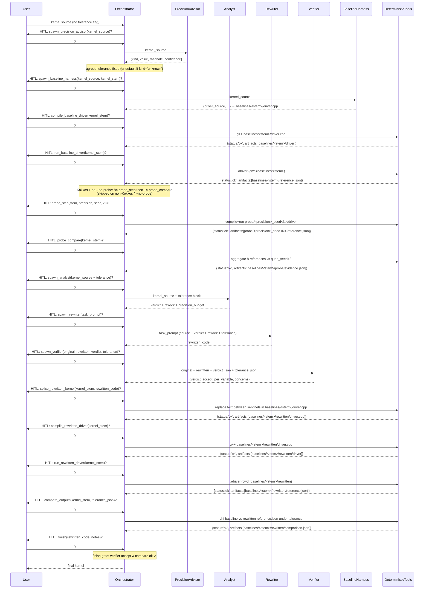

# Agent-Precision

An LLM orchestrator that rewrites numerical kernels (Kokkos, CUDA, HIP,
SYCL, and OpenMP-offload) to use less floating-point storage where it is
safe to do so, given a user-stated tolerance on the kernel's output
precision.

**Why precision matters for throughput.** Modern GPUs accelerate `float`
much more than `double` (and accelerate narrower-than-`float` types more
still), while `double` performance has stagnated. Most scientific kernels
are written in `double` out of habit, not need: their inputs and outputs
don't carry enough significant figures to justify it. The cost of that
habit is throughput. This tool's job is to find the per-variable storage
type that satisfies the user's output-precision tolerance and no more.

This is a research prototype and a deliberate learning exercise in agent
orchestration and tool-calling. It is a single Python package (`workflow/`)
that talks to the Anthropic SDK. There is no build system and no CI. A
small Layer 1 test suite (`tests/`, run with `python -m pytest -q`) covers
the workflow plumbing with monkeypatched API calls; a Layer 2 harness
(`evals/layer2/`) grades agent judgment end-to-end over the 17-kernel
`test-kernels/` corpus. Features are added in small, observable steps
rather than as end-to-end machinery.

If you want to hack on the workflow itself, read `AGENTS.md` first — it
contains the gotchas (model id, env-loading, backend quirks) that will
otherwise burn you.

## Precision vocabulary

Three things this project keeps deliberately separate:

- **`sig_figs`** — *relative* tolerance on the kernel's output (`--sig-figs 6` ≈ relative error below `1e-6`).
- **`decimal_digits`** — *absolute* tolerance on the output (`--decimal-digits 4` ≈ absolute error below `1e-4`).
- **Storage precision** (`float`, `double`, `float-float`, …) — how wide a variable is in memory. A kernel can hit a sig-figs target using a *mix* of storage precisions; that mix is what the analyst chooses.

Tolerance is the **target**; storage precision is the **mechanism**.
Full plumbing details (the `{kind, value, source}` dict, the `source`
enum, how it flows through prompts) live in `AGENTS.md` under "Tolerance
vocabulary and plumbing".

## Status

What works today:

- Core pipeline `(precision_advisor →)? analyst → rewriter → verifier`. `finish` is gated in **code** (not just in the system prompt) on the most recent `spawn_verifier` returning `verdict='accept'`; on a Kokkos `.cpp` input, `finish` additionally requires the most recent `compare_outputs` to have returned `status='ok'` for the current rewrite cycle. A premature `finish` is turned into a synthetic `{status:'error', is_error:true}` tool result naming what's missing, so the orchestrator can self-correct without exiting.
- Dynamic verification chain (any profile whose `LanguageProfile.dynamic_verification` is `True` — currently all five): **harness → compile → run → splice → compile_rewritten → run_rewritten → compare_outputs**, ending in a tolerance check that gates `finish`. The five LLM agents are reused as-is; the six deterministic (non-LLM) tools in `workflow/tools.py` (`compile_baseline_driver`, `run_baseline_driver`, `splice_rewritten_kernel`, `compile_rewritten_driver`, `run_rewritten_driver`, `compare_outputs`) all return the uniform `{status, stdout, stderr, artifacts}` shape. `baseline_harness` writes `baselines/<kernel_stem>/<driver_filename>` (`.cpp` for Kokkos/SYCL/OpenMP-offload, `.cu` for CUDA, `.hip` for HIP); the baseline compile/run trio produces `baselines/<kernel_stem>/{driver, reference.json}`; the rewritten chain (splice → compile_rewritten → run_rewritten) produces `baselines/<kernel_stem>/rewritten/{driver.<ext>, driver, reference.json}` from the rewriter's output without ever touching the baseline tree; `compare_outputs` diffs the two `reference.json` files under the same `tolerance_json` that was passed to `spawn_verifier` and writes `baselines/<kernel_stem>/rewritten/comparison.json` on both pass and fail paths. Kokkos is smoke-validated end-to-end; CUDA is smoke-validated through the comparator step (on `vector_add.cu --sig-figs 6 --auto`); HIP, SYCL, and OpenMP-offload ship unit-tested only — no host with the respective toolchain (`hipcc`, `icpx`/`clang++ -fsycl`, `clang++ -fopenmp -fopenmp-targets=...`) was available at implementation time.
- Probe pipeline (any profile whose `LanguageProfile.probe_precisions` is non-empty — currently Kokkos only): a pre-analyst empirical sweep that runs the kernel under 4 precisions (`quad`, `double`, `float`, `mixed_io`) × 2 RNG seeds (`{42, 43}`) and feeds the per-output statistics into the analyst's task as a descriptive evidence block (no verdict hints — see `_format_probe_evidence_for_analyst` in `orchestrator.py`). Two new deterministic tools in `workflow/tools.py` — `probe_step` (fused compile+run per cell; 8 calls per Kokkos kernel) and `probe_compare` (aggregates the 8 references against `quad_seed42` ground truth) — both return the same `{status, stdout, stderr, artifacts}` shape as the dynamic-verification tools and write under `baselines/<kernel_stem>/probe/`. Probe failures are non-fatal: only a missing `quad_seed42` cell hard-errors; every other per-cell error is reported by `probe_compare` and the analyst still runs. Opt out with `--no-probe`; CUDA / HIP / SYCL / OMP-offload silently skip the probe regardless. See `AGENTS.md` ("Probe pipeline") for the contract.
- Tolerance from `--sig-figs` / `--decimal-digits`, else inferred by the advisor; advisor may return `kind='unknown'`, which triggers fallback `{sig_figs: 6, source: 'advisor_unknown_defaulted'}`.
- Tolerance threaded verbatim to analyst, rewriter, and verifier; analyst returns a `precision_budget` block; verifier audits it.
- Per-variable methods: `downcast` (narrower hardware type — the throughput win), `emulate` (software pair, currently inline float-float / Dekker — throughput-NEGATIVE; only when downcast violates tolerance), or `keep`. Analyst can additionally suggest a kernel-shape `rework` such as Kahan summation.
- HITL pause before every agent call (`y` / `n` / `q`); rejection feeds `{"status": "rejected_by_user"}` back so the orchestrator can self-correct. `--auto` skips the pause for batch runs and writes a JSONL trace of every executed tool to `baselines/<kernel_stem>/orchestrator_trace.jsonl`.
- Optional **analyst self-consistency ensemble**: opt-in via `AGENT_PRECISION_ANALYST_K > 1` (with diversity temperature `AGENT_PRECISION_ANALYST_T`, default `0.7`). Runs the analyst K times in parallel and folds the verdicts through `workflow/aggregator.py` — per-variable plurality with `keep > emulate > downcast` conservative tiebreak, strict-majority rework vote, budget+notes from the most-aligned verdict. Default `K=1` preserves the existing single-shot behavior.
- Optional **verifier perspective-diverse panel**: opt-in via `AGENT_PRECISION_VERIFIER_K > 1` (with `AGENT_PRECISION_VERIFIER_T`, default `0.7`). Runs the verifier K times in parallel under K distinct lenses (faithfulness → budget → edge_cases; defined in `workflow/verifier_panel.py:VERIFIER_LENSES`) and folds the results through `aggregate_verifier_verdicts` — strict-accept (any dissent flips to reject), per-variable owned by the faithfulness lens, concerns unioned and prefixed with `[<lens>]` for richer rewriter-retry feedback. `K` is capped at the number of defined lenses.
- Registry-driven agent definitions: one entry in `workflow/registry.py` per agent type; the generic runner is untouched.
- Three execution backends: direct `api.anthropic.com`, Argo via local `argo-proxy`, and Argo via SSH tunnel + shim (fallback).

What is intentionally **not** here yet:

- The `verifier` agent itself remains a **static / textual** check on faithfulness of code to verdict; mechanical verification of the rewritten kernel is now done by the `compare_outputs` tool downstream of it (not by the verifier agent). No micro-benchmark of the rewritten kernel — `compare_outputs` checks numerical agreement under tolerance, not throughput.
- End-to-end smoke validation for HIP, SYCL, and OpenMP-offload (the relevant toolchains were not available on the development host). All three are exercised by the unit tests in `tests/test_tools.py` / `tests/test_registry.py` / `tests/test_languages.py` but no real kernel in each language has been driven through the full chain yet.
- No framework (LangGraph etc.). See "Design notes" and "Roadmap".

## Run

Only dependency: `anthropic>=0.40.0`.

```bash
pip install -r requirements.txt
```

Stdout in every mode is the orchestrator's reasoning, then a HITL prompt
for each proposed tool call, then the final rewritten kernel and notes.

**Tolerance flags (optional, mutually exclusive).** Both Argo wrapper
scripts forward all extra arguments to `python -m workflow.run`.

```text
--sig-figs N         relative tolerance: ~N significant figures of agreement
--decimal-digits N   absolute tolerance: ~N decimal places of agreement
--auto               skip the HITL pause; write JSONL trace to
                     baselines/<kernel_stem>/orchestrator_trace.jsonl
```

If neither tolerance flag is given, the orchestrator calls the
`precision_advisor` agent to infer one from the kernel source (see
"Status" for the `kind='unknown'` fallback).

**Optional ensemble env vars** (default behavior is unchanged when unset):

```text
AGENT_PRECISION_ANALYST_K=N    run analyst N times in parallel and aggregate
AGENT_PRECISION_ANALYST_T=F    sampling temperature for the analyst ensemble (default 0.7)
AGENT_PRECISION_VERIFIER_K=N   run verifier under N distinct lenses (N <= 3)
AGENT_PRECISION_VERIFIER_T=F   sampling temperature for the verifier panel (default 0.7)
```

**Direct (Anthropic API).** `.env` is not auto-loaded.

```bash
set -a; source .env; set +a            # exports ANTHROPIC_API_KEY etc.
python -m workflow.run test-kernels/kokkos/mixed/nbody_force.cpp --sig-figs 6
```

**Argo via local `argo-proxy` (recommended on Argonne hosts).** Requires
`argo-proxy serve` already running; no per-session Duo prompt.

```bash
./scripts/run-argoproxy.sh test-kernels/kokkos/mixed/nbody_force.cpp --decimal-digits 4
```

**Argo via SSH tunnel + shim (fallback).** Use when `argo-proxy` is not
installed on this host.

```bash
./scripts/run-argo.sh test-kernels/kokkos/mixed/nbody_force.cpp
```

See `AGENTS.md` for backend details (ports, model-id quirks, why both
Argo paths exist).

## Workflow

Intended happy path through the conversation for a Kokkos `.cpp` input
when no tolerance flag is passed (so the advisor is called once up
front, and the full dynamic-verification chain runs). The same shape
applies to CUDA, HIP, SYCL, and OpenMP-offload — only the driver file
extension (`.cu` / `.hip` / `.cpp`) and the compiler invoked by the
deterministic tools change; the orchestrator loop, finish-gate, and
HITL contract are language-agnostic. For the corresponding high-level
flowchart (HITL branches, tool dispatch, finish-gate), see
`flowchart.md`.



On `verdict='reject'`, the orchestrator either re-spawns the rewriter
with a task prompt that incorporates the verifier's mismatches and
concerns, or — if those concerns implicate the analyst's verdict itself
— re-spawns the analyst. Either way, a fresh `spawn_verifier` must
return `accept` before `finish` is allowed. On a `compare_outputs`
error, the orchestrator is steered (by both the system prompt and the
synthetic gate-violation tool result) toward `spawn_analyst` rather
than `spawn_rewriter`, because a numerical mismatch usually indicates
the verifier's verdict was wrong rather than just the implementation.

## Agents

| Agent                | Model             | Input                                                                                       | Output (schema keys)                                                                                                                                                                                                                                            | Defined in                 |
| -------------------- | ----------------- | ------------------------------------------------------------------------------------------- | --------------------------------------------------------------------------------------------------------------------------------------------------------------------------------------------------------------------------------------------------------------- | -------------------------- |
| `precision_advisor`  | `claude-opus-4-7` | kernel source only                                                                          | `kind` (`sig_figs`/`decimal_digits`/`unknown`), `value`, `rationale`, `confidence` (`high`/`medium`/`low`), `alternative`                                                                                                                                       | `workflow/registry.py`     |
| `analyst`            | `claude-opus-4-7` | kernel source + tolerance block (`target_kind`, `target_value`, `source`)                   | `variables[{name, action, target_precision, emulation_type, reason}]`, `rework{suggested, transformation, rationale, affected_variables}`, `precision_budget{target_kind, target_value, source, claimed_output_precision, headroom_argument}`, `overall_notes` | `workflow/registry.py`     |
| `rewriter`           | `claude-opus-4-7` | `task_prompt` (source + verdict + any rework + tolerance, composed by orch.)                | `rewritten_code`, `summary_of_changes`                                                                                                                                                                                                                          | `workflow/registry.py`     |
| `verifier`           | `claude-opus-4-7` | original source, rewritten source, analyst verdict (JSON string), tolerance (JSON string)   | `verdict` (`accept`/`reject`), `per_variable[{name, expected_action, observed_action, ok}]`, `concerns`                                                                                                                                                         | `workflow/registry.py`     |
| `baseline_harness_<id>` | `claude-opus-4-7` | original kernel source (one harness agent per language profile; orchestrator dispatches by `LanguageProfile.id` resolved from the file suffix and source content) | `driver_source`, `kernel_function_name`, `inputs_summary`, `output_arrays` | `workflow/registry.py` (auto-registered from `workflow/languages/PROFILES`) |
| `orchestrator`       | `claude-opus-4-7` | kernel path + source + optional tolerance (from CLI) + optional `kernel_name`               | one `finish(rewritten_code, notes)` call                                                                                                                                                                                                                        | `workflow/orchestrator.py` |

The analyst receives the kernel source only — no file path, no orchestrator
hints — so that ground-truth labels encoded in directory names cannot leak
into the verdict. The same holds for the precision_advisor.

The analyst is told the tolerance is a hard constraint, and that
`emulate` is throughput-negative and only justified when `downcast` would
violate that tolerance. The rewriter is forbidden from silently
substituting one method for another (e.g. downcasting when asked to
emulate), so the verifier's per-variable `ok` check has actual meaning.

The analyst and verifier each have an optional K-fold mode that the
orchestrator picks up from environment variables (default `K=1`,
behavior unchanged when unset; see "Run"):

- `AGENT_PRECISION_ANALYST_K > 1` → the analyst is called K times in
  parallel at `AGENT_PRECISION_ANALYST_T` (default `0.7`) and its
  verdicts are folded by `workflow/aggregator.py` into a single
  schema-conformant verdict (per-variable plurality with
  `keep > emulate > downcast` conservative tiebreak; strict-majority
  rework; budget+notes from the most-aligned source verdict). The
  disagreement report rides alongside the result as
  `aggregator_metadata` for the orchestrator trace.
- `AGENT_PRECISION_VERIFIER_K > 1` (capped at the number of defined
  lenses, currently 3) → the verifier is called K times in parallel
  under K distinct lenses (`faithfulness`, `budget`, `edge_cases`;
  defined in `workflow/verifier_panel.py:VERIFIER_LENSES`) at
  `AGENT_PRECISION_VERIFIER_T` (default `0.7`). Each lens is a
  per-call system-prompt suffix appended via
  `run_agent(..., system_prompt_suffix=...)`, so the base verifier
  prompt in `registry.py` stays the single source of truth. The K
  verdicts fold to a single schema-conformant verdict: strict-accept
  (any single lens reject flips the whole verdict), `per_variable`
  from the faithfulness lens verbatim, `concerns` unioned across
  lenses and prefixed with `[<lens>] ` so a rewriter-retry prompt
  sees which lens raised which concern.

The `baseline_harness_<id>` agents are orthogonal to the analyst →
rewriter → verifier pipeline: one is invited (by the initial user
message's BASELINE STEP block, parameterized by the resolved
`LanguageProfile`) per run, only when the input matches a profile whose
`dynamic_verification` is `True` and whose `source_suffixes` cover the
file, and its output is a driver source. The orchestrator then chains
two deterministic (non-LLM) tools after it — `compile_baseline_driver`
(once, same `kernel_stem`) and `run_baseline_driver` (once, same
`kernel_stem`) — to produce `baselines/<kernel_stem>/{driver,
reference.json}`. Each driver pins a serial execution backend and a
fixed RNG seed (42 by default) so the reference output is reproducible
— Kokkos uses `Kokkos::Serial`; CUDA / HIP launch with `<<<1,1>>>`;
SYCL uses an in-order queue with a single-item range; OpenMP-offload
uses `omp_set_num_threads(1)` plus `num_teams(1) thread_limit(1)`. Each
harness mandates the splice sentinels (`// ---- KERNEL BEGIN ----` /
`// ---- KERNEL END ----`) around the inlined kernel; the downstream
`splice_rewritten_kernel` tool then swaps in the rewritten kernel
between them for the rewritten chain. See `AGENTS.md` ("Baseline
harness and dynamic verification chain") for the full scope and per-
profile contracts (precision aliases, env vars, language probes).

## Orchestrator tools

| Tool                       | Purpose                       | Input                                                                                                                          | Returns to orchestrator                                                  |
| -------------------------- | ----------------------------- | ------------------------------------------------------------------------------------------------------------------------------ | ------------------------------------------------------------------------ |
| `spawn_precision_advisor`  | dispatch to precision_advisor | `kernel_source: string`                                                                                                        | advisor's structured output, or `{"status":"rejected_by_user"}`          |
| `spawn_analyst`            | dispatch to analyst           | `kernel_source: string` (must contain a labeled tolerance block: `target_kind`, `target_value`, `source`)                      | analyst's structured output, or `{"status":"rejected_by_user"}`          |
| `spawn_rewriter`           | dispatch to rewriter          | `task_prompt: string`                                                                                                          | rewriter's structured output, or `{"status":"rejected_by_user"}`         |
| `spawn_verifier`           | dispatch to verifier          | `original_source: string`, `rewritten_source: string`, `analyst_verdict_json: string`, `tolerance_json: string`                | verifier's structured output, or `{"status":"rejected_by_user"}`         |
| `spawn_baseline_harness_<id>` | dispatch to the language-specific baseline_harness agent | `kernel_source: string`, `kernel_stem: string` (one harness per `LanguageProfile.id`; at most once per run; only when `profile.dynamic_verification` is `True`) | harness output + `driver_path` (orchestrator writes `baselines/<kernel_stem>/<driver_filename>` — `.cpp`/`.cu`/`.hip` per profile), or `{"status":"rejected_by_user"}` |
| `compile_baseline_driver`  | `g++` the harness driver (deterministic, non-LLM) | `kernel_stem: string` (at most once per run; only after a successful `spawn_baseline_harness` with same stem; needs `AGENT_PRECISION_KOKKOS_ROOT`) | `{status, stdout, stderr, artifacts}` (artifacts = `[baselines/<stem>/driver]` on success, `[]` otherwise), or `{"status":"rejected_by_user"}` |
| `run_baseline_driver`      | exec the compiled driver to capture reference output (deterministic, non-LLM) | `kernel_stem: string` (at most once per run; only after a successful `compile_baseline_driver` with same stem; bounded by `AGENT_PRECISION_RUN_TIMEOUT_SEC`, default 60 s) | `{status, stdout, stderr, artifacts}` (artifacts = `[baselines/<stem>/reference.json]` on success, `[]` otherwise), or `{"status":"rejected_by_user"}` |
| `splice_rewritten_kernel`  | replace text between `// ---- KERNEL BEGIN/END ----` sentinels in the baseline driver with the rewriter's output (deterministic, non-LLM; pure text I/O) | `kernel_stem: string`, `rewritten_kernel_source: string` (at most once per accepted verifier verdict; only after a successful `run_baseline_driver` + `spawn_verifier(accept)` with same stem) | `{status, stdout, stderr, artifacts}` (artifacts = `[baselines/<stem>/rewritten/driver.cpp]` on success, `[]` otherwise), or `{"status":"rejected_by_user"}` |
| `compile_rewritten_driver` | `g++` the spliced rewritten driver (deterministic, non-LLM) | `kernel_stem: string` (at most once per accepted verifier verdict; only after a successful `splice_rewritten_kernel` with same stem; needs `AGENT_PRECISION_KOKKOS_ROOT`) | `{status, stdout, stderr, artifacts}` (artifacts = `[baselines/<stem>/rewritten/driver]` on success, `[]` otherwise), or `{"status":"rejected_by_user"}` |
| `run_rewritten_driver`     | exec the rewritten driver to capture its reference output (deterministic, non-LLM; never touches the baseline tree) | `kernel_stem: string` (at most once per accepted verifier verdict; only after a successful `compile_rewritten_driver` with same stem; bounded by `AGENT_PRECISION_RUN_TIMEOUT_SEC`) | `{status, stdout, stderr, artifacts}` (artifacts = `[baselines/<stem>/rewritten/reference.json]` on success, `[]` otherwise), or `{"status":"rejected_by_user"}` |
| `compare_outputs`          | numerically diff baseline vs rewritten `reference.json` under tolerance; gates `finish` on `.cpp` (deterministic, non-LLM; no subprocess) | `kernel_stem: string`, `tolerance_json: string` (same `{kind,value,source}` string passed to `spawn_verifier`; at most once per accepted verifier verdict; only after a successful `run_rewritten_driver`) | `{status, stdout, stderr, artifacts}` (artifacts = `[baselines/<stem>/rewritten/comparison.json]` on both pass and fail; `status='ok'` iff every value agrees and no shape mismatch), or `{"status":"rejected_by_user"}` |
| `probe_step`               | fused compile+run of one per-(precision, seed) probe driver (deterministic, non-LLM; Kokkos only in v0; not finish-gating) | `kernel_stem: string`, `precision: string` (one of `LanguageProfile.probe_precisions`), `seed: integer` (one of `_PROBE_SEEDS = (42, 43)`); 8 calls per Kokkos run; only after a successful `run_baseline_driver` with same stem; `language_id` is injected by `_execute_tool`, never passed by the LLM | `{status, stdout, stderr, artifacts}` (artifacts = `[baselines/<stem>/probe/<precision>_seed<N>/reference.json]` on success, `[]` otherwise), or `{"status":"rejected_by_user"}` |
| `probe_compare`            | aggregate the 8 probe references into `evidence.json` for the next `spawn_analyst` (deterministic, non-LLM; no subprocess; Kokkos only in v0; not finish-gating) | `kernel_stem: string`; one call per Kokkos run; only after all 8 `probe_step` calls; `language_id` is injected by `_execute_tool`, never passed by the LLM | `{status, stdout, stderr, artifacts}` (artifacts = `[baselines/<stem>/probe/evidence.json]`; only a missing `quad_seed42` cell hard-errors — every other per-cell problem is reported per-entry in `evidence.json`), or `{"status":"rejected_by_user"}` |
| `finish`                   | end the workflow              | `rewritten_code`, `notes`                                                                                                      | (terminates; nothing fed back) — but the orchestrator's `_FinishGateState` blocks the call (with a synthetic `is_error` tool result) until the gate is satisfied: verifier `verdict='accept'`, plus `compare_outputs status='ok'` for any profile with `dynamic_verification=True` (currently all five) |

The orchestrator's system prompt enforces that `spawn_precision_advisor`
is called at most once, only when the CLI passed no tolerance, and only
before `spawn_analyst`; that exactly one `spawn_baseline_harness_<id>`
tool exists per run (the one matching the resolved
`LanguageProfile.id`) and is called at most once; that the
seven-step deterministic chain — `compile_baseline_driver` →
`run_baseline_driver` → `splice_rewritten_kernel` →
`compile_rewritten_driver` → `run_rewritten_driver` → `compare_outputs`
— each fires at most once per accepted verifier verdict, only as the
deterministic follow-up to a successful preceding step, and always with
the same `kernel_stem`; and that on profiles whose
`LanguageProfile.probe_precisions` is non-empty (Kokkos in v0) the
probe pipeline runs once between `run_baseline_driver` and
`spawn_analyst` — 8× `probe_step` (one per (precision, seed) cell)
followed by 1× `probe_compare` — unless `--no-probe` is passed. The
probe is NOT finish-gating. Those rules are trusted to the orchestrator
LLM. Three things are policed in Python instead: (1) the filesystem
write for `spawn_baseline_harness_<id>` and the splice writes both
compute their paths from the orchestrator-supplied `kernel_stem` (not
from the agent's output) so a misbehaving agent cannot redirect them;
(2) every "run" tool deletes any stale `reference.json` at its target
path before invoking the subprocess, so a failed run cannot leave a
misleadingly-stale reference in place; and (3) the **finish-gate** in
`_FinishGateState` blocks `finish` until the most recent
`spawn_verifier` returned `verdict='accept'` AND, on any profile with
`dynamic_verification=True`, the most recent `compare_outputs` returned
`status='ok'` for the current rewrite cycle. On a gate violation the loop synthesizes a `{status:
'error', is_error: true}` tool result naming what's missing, so the
orchestrator can self-correct on its next turn rather than silently
exiting.

## Repo layout

- `workflow/`
  - `languages/` — one module per supported language profile (`kokkos.py`,
    `cuda.py`, `hip.py`, `sycl.py`, `omp_offload.py`) plus `base.py`
    (the `LanguageProfile` dataclass, the shared splice sentinels, and
    `make_error_result`). Each module exposes a `*_PROFILE` instance;
    `workflow/languages/__init__.py` collects them into the ordered
    `PROFILES` list. `registry.py` walks `PROFILES` to auto-register a
    `baseline_harness_<id>` agent per profile (no per-language edit to
    `AGENTS`), and `workflow/tools.py:_resolve_profile` dispatches the
    six deterministic tools by `language_id`.
  - `registry.py` — agent definitions (`AGENTS` dict: system prompt, output
    schema, model). Single source of truth for the five non-harness
    agents; the per-language `baseline_harness_<id>` entries are
    appended at import time from `workflow/languages/PROFILES`.
  - `run_agent.py` — generic agent runner. Forces structured output via
    `tool_choice={"type":"tool","name":"submit_result"}` whose input schema
    is the registry entry's `output_schema`. Never edited per-agent.
    Sets `max_tokens=32768` (raised from 8192 to accommodate the Kokkos
    v1 baseline_harness, which emits four full per-precision drivers in
    one `submit_result` call) and passes an explicit `timeout=600.0` to
    the SDK (the SDK refuses non-streaming requests whose own estimated
    duration exceeds 10 minutes; an explicit `timeout` is the
    SDK-sanctioned escape hatch). Also exports
    `run_agent_ensemble(type, task, k, temperature)` — a
    `ThreadPoolExecutor` fan-out used by the analyst self-consistency
    ensemble and (via the verifier panel) the per-lens verifier runs.
  - `aggregator.py` — deterministic K-fold aggregator for analyst
    verdicts. Per-variable plurality with `keep > emulate > downcast`
    conservative tiebreak; strict-majority rework vote; budget +
    overall_notes echoed from the most-aligned source verdict. Returns
    `(aggregated_verdict, disagreement_report)` for the orchestrator
    trace.
  - `verifier_panel.py` — `VERIFIER_LENSES` (faithfulness → budget →
    edge_cases), `run_verifier_panel` (parallel fan-out per lens via
    `run_agent` with `system_prompt_suffix=lens['suffix']`), and
    `aggregate_verifier_verdicts` (strict-accept; per_variable from the
    faithfulness lens; concerns unioned, deduped, prefixed `[<lens>]`).
  - `orchestrator.py` — router + HITL loop. One tool per agent type plus
    `finish`. `--auto` mode bypasses the HITL pause and journals every
    executed tool to `baselines/<kernel_stem>/orchestrator_trace.jsonl`.
    Ensemble/panel dispatch lives in `_execute_tool`'s `spawn_analyst`
    and `spawn_verifier` branches, gated on the `AGENT_PRECISION_*_K`
    env vars.
  - `run.py` — CLI entrypoint
    (`python -m workflow.run <kernel_file> [--sig-figs N | --decimal-digits N] [--auto]`).
    Normalizes tolerance flags into `{kind, value, source='user_cli'}`
    or `None`, then hands off to the orchestrator.
- `test-kernels/` — 17 kernels under
  `{cuda,kokkos}/{lowerable,needs_precision,mixed}/`. Directory name is
  the ground-truth label and is **never** fed into agent prompts. Per-
  variable expected verdicts and test tolerances live in
  `test-kernels/SUMMARY.md` and are used for evaluating orchestrator
  output, not as input to it.
- `baselines/` — generated per-kernel artifacts from the dynamic-verification
  chain. Baseline tree:
  `baselines/<kernel_stem>/{driver.cpp, driver, reference.json}` (from
  `spawn_baseline_harness` → `compile_baseline_driver` →
  `run_baseline_driver`). Rewritten tree, written without ever touching
  the baseline tree:
  `baselines/<kernel_stem>/rewritten/{driver.cpp, driver, reference.json,
  comparison.json}` (from `splice_rewritten_kernel` →
  `compile_rewritten_driver` → `run_rewritten_driver` → `compare_outputs`).
  Under `--auto`, this directory also receives
  `baselines/<kernel_stem>/orchestrator_trace.jsonl` (one JSONL record per
  executed tool: `{turn, tool_name, tool_input, exec_result}`, truncated
  at the start of each auto run). Gitignored.
- `evals/layer2/` — Layer 2 (agent-judgment) evaluation harness. Grades
  the workflow end-to-end over the 17-kernel `test-kernels/` corpus by
  spawning `python -m workflow.run --auto ...` per kernel as a
  subprocess, then reading `baselines/<stem>/orchestrator_trace.jsonl`
  and scoring it against `evals/layer2/expected.py` (the hand-
  transcribed per-variable ground-truth registry, kept in sync with
  `test-kernels/SUMMARY.md` by `tests/test_evals_expected.py`). The
  harness does not import from `workflow.*` — it is a strict subprocess-
  contract consumer. Run output lands in `evals/results/<timestamp>_<label>/`
  and is gitignored. See `AGENTS.md` ("Conventions") for the run / report
  / score module split.
- `scripts/` — Argo backend wrappers (`run-argoproxy.sh`, `run-argo.sh`).
- `flowchart.md` — high-level orchestrator flowchart (HITL branches,
  tool dispatch); a companion to the sequence diagram above.
- `AGENTS.md` — instructions for coding agents working on this repo.
  Contains the gotchas you need before changing anything.
- `opencode.json` — opencode configuration. Unrelated to the workflow
  itself; only relevant if you run opencode against this repo.

## Design notes

**Why the user states the tolerance.** Output precision is a domain
judgment, not a numerical one. CLI flags make it explicit and the
orchestrator threads it through every downstream agent verbatim, so the
target never silently drifts.

**Why a separate precision_advisor agent.** When the user gives no
tolerance, a single LLM call that *only* infers one is cleaner than
folding that inference into the analyst's per-variable verdict. The
advisor is allowed to return `kind='unknown'`; the orchestrator then
falls back to a documented default (`{sig_figs: 6,
source: 'advisor_unknown_defaulted'}`) rather than acting on a
confident-sounding guess. Fallback rule lives in the orchestrator's
system prompt, not in Python.

**Why a separate analyst agent (vs a smarter rewriter).** Keeps the
rewriter mechanical, makes the HITL pause informative (structured
verdict before code is touched), and gives the verifier a structured
artifact to check against.

**Why the verifier is a separate (static) agent.** Faithfulness of the
rewrite to the verdict is a textual check the rewriter cannot honestly
self-report. Splitting it out also draws a clean line for future
mechanical verifiers (compile, run, compare), which will be orchestrator
**tools**, not new agents.

Two further "why" notes — **why HITL on every tool call** and **why the
registry pattern** — are covered in `AGENTS.md` under "Architecture".
LangGraph (and similar frameworks) are not adopted yet for the reasons
in "Roadmap" below; see `AGENTS.md` for the full rationale.

## Roadmap

Authoritative list lives in `AGENTS.md` under "Planned next steps"; this
is a reader-facing summary.

1. **Kernel-extractor agent** — slice a single target kernel out of a multi-kernel translation unit before analyst + baseline_harness run.
2. **Smoke-validation of HIP / SYCL / OpenMP-offload profiles** — these three profiles ship unit-tested only (no `hipcc` / `icpx` / `clang++ -fopenmp -fopenmp-targets=...` toolchain was available at implementation time). Once a host with the respective runtime is available, drive a real kernel through the full chain and confirm the comparator step passes; remove the "unit-tested but not smoke-validated" caveat from `AGENTS.md`.
3. **JLSE / async toolchain migration** — move compile/run to a remote scheduler.
4. **Emulation library upgrade** — replace inline Dekker float-float with a vendored header.
5. **Corpus evaluation hardening** — the Layer 2 harness (`evals/layer2/`) already runs the workflow across the 17-kernel `test-kernels/` corpus in `--auto` mode and grades the resulting `orchestrator_trace.jsonl` against the per-variable ground truth in `evals/layer2/expected.py`. Open work: extend the scorer to cover the rework / precision_budget axes (today it grades per-variable verdicts and finish-gate status); add a "regression vs baseline" comparator that takes two `results.json` runs as input; explore re-running the harness under non-default `AGENT_PRECISION_ANALYST_K` / `AGENT_PRECISION_VERIFIER_K` settings to measure the ensemble's effect on judgment quality.

Explicitly **not** on the roadmap (see `AGENTS.md` for rationale):
multiple per-method analysts, and adopting LangGraph at this scale.
