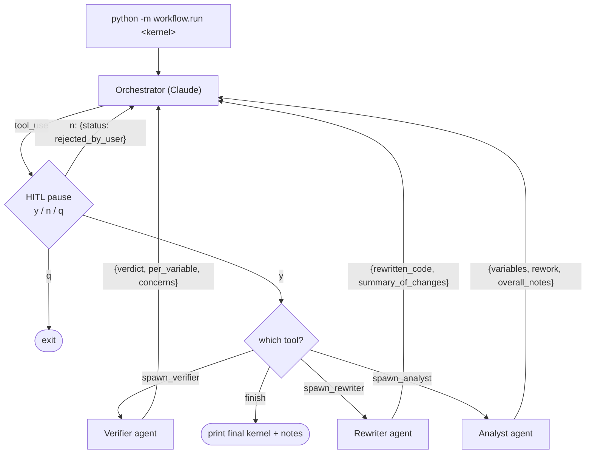
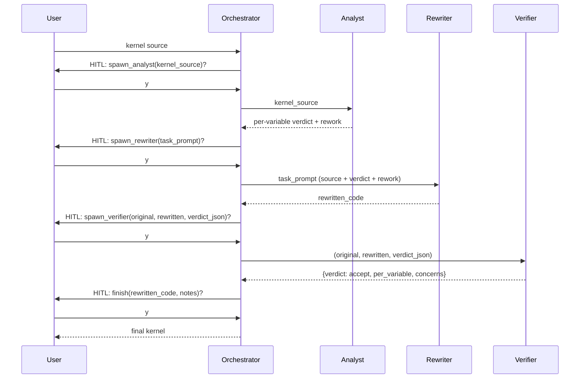

# Agent-Precision

An LLM orchestrator that rewrites numerical kernels (Kokkos C++ / CUDA) to
lower precision where it is numerically safe to do so.

This is a research prototype and a deliberate learning exercise in agent
orchestration and tool-calling. It is a single Python package (`workflow/`)
that talks to the Anthropic SDK. There is no build system and no CI. A
small Layer 1 test suite (`tests/`, run with `python -m pytest -q`) covers
the workflow plumbing with monkeypatched API calls; there is no Layer 2
evaluation of agent judgment yet. Features are added in small, observable
steps rather than as end-to-end machinery.

If you want to hack on the workflow itself, read `AGENTS.md` first — it
contains the gotchas (model id, env-loading, backend quirks) that will
otherwise burn you.

## Status

What works today:

- Three-agent pipeline: **analyst → rewriter → verifier**, driven by an LLM
  orchestrator. The orchestrator's system prompt forbids calling `finish`
  unless the most recent verifier returned `verdict='accept'`.
- Analyst can choose between three per-variable methods —
  `downcast` (replace with a narrower hardware type, e.g. `double → float`),
  `emulate` (replace with a software-emulated pair, currently float-float /
  Dekker written inline as `struct ff_t {float hi, lo;}`), or `keep` — and
  can additionally suggest a kernel-shape `rework` such as Kahan summation.
- Human-in-the-loop pause before every agent call (`y` / `n` / `q`).
  Rejections are fed back to the orchestrator as
  `{"status": "rejected_by_user"}`, so it can self-correct without burning
  another agent call.
- Registry-driven agent definitions: adding a new agent type is one entry
  in `workflow/registry.py`; the generic runner does not change.
- Three execution backends: direct `api.anthropic.com`, Argo via local
  `argo-proxy`, and Argo via SSH tunnel + shim (fallback).

What is intentionally **not** here yet:

- The verifier is a **static / textual** check: it compares the rewritten
  code against the analyst's verdict for faithfulness. No mechanical
  verification.
- No compilation check, no accuracy check, no benchmark runner.
- No automated evaluation across the `test-kernels/` corpus.
- No framework (LangGraph etc.). See "Design notes" and "Roadmap" below.

## Run

Only dependency: `anthropic>=0.40.0`.

```bash
pip install -r requirements.txt
```

Stdout in every mode is the orchestrator's reasoning, then a HITL prompt
for each proposed tool call, then the final rewritten kernel and notes.

**Direct (Anthropic API).** `.env` is not auto-loaded.

```bash
set -a; source .env; set +a            # exports ANTHROPIC_API_KEY etc.
python -m workflow.run test-kernels/kokkos/mixed/nbody_force.cpp
```

**Argo via local `argo-proxy` (recommended on Argonne hosts).** Requires
`argo-proxy serve` already running; no per-session Duo prompt.

```bash
./scripts/run-argoproxy.sh test-kernels/kokkos/mixed/nbody_force.cpp
```

**Argo via SSH tunnel + shim (fallback).** Use when `argo-proxy` is not
installed on this host. Brings up its own tunnel and local Anthropic-
compatible shim.

```bash
./scripts/run-argo.sh test-kernels/kokkos/mixed/nbody_force.cpp
```

See `AGENTS.md` for the backend details (ports, model-id quirks, why both
Argo paths exist).

## Workflow

High-level flow. The orchestrator is itself a Claude conversation; its
tools are one per agent type plus a `finish` tool.



Edge enforcement: the `analyst → rewriter → verifier → finish` order and
the "no `finish` without `verdict='accept'`" rule live in the
orchestrator's **system prompt**, not in code. The HITL pause and the
`MAX_TURNS=20` backstop are the only code-level guardrails.

Intended happy path through the conversation:



On `verdict='reject'`, the orchestrator either re-spawns the rewriter
with a task prompt that incorporates the verifier's mismatches and
concerns, or — if those concerns implicate the analyst's verdict itself
— re-spawns the analyst. Either way, a fresh `spawn_verifier` must
return `accept` before `finish` is allowed.

## Agents

| Agent          | Model             | Input                                                              | Output (schema keys)                                                                                                                                                                 | Defined in                 |
| -------------- | ----------------- | ------------------------------------------------------------------ | ------------------------------------------------------------------------------------------------------------------------------------------------------------------------------------ | -------------------------- |
| `analyst`      | `claude-opus-4-7` | kernel source only                                                 | `variables[{name, action, target_precision, emulation_type, reason}]`, `rework{suggested, transformation, rationale, affected_variables}`, `overall_notes`                           | `workflow/registry.py`     |
| `rewriter`     | `claude-opus-4-7` | `task_prompt` (source + verdict + any rework, composed by orch.)   | `rewritten_code`, `summary_of_changes`                                                                                                                                               | `workflow/registry.py`     |
| `verifier`     | `claude-opus-4-7` | original source, rewritten source, analyst verdict (JSON string)   | `verdict` (`accept`/`reject`), `per_variable[{name, expected_action, observed_action, ok}]`, `concerns`                                                                         | `workflow/registry.py`     |
| `orchestrator` | `claude-opus-4-7` | kernel path + source                                               | one `finish(rewritten_code, notes)` call                                                                                                                                             | `workflow/orchestrator.py` |

The analyst receives the kernel source only — no file path, no orchestrator
hints — so that ground-truth labels encoded in directory names cannot leak
into the verdict.

## Orchestrator tools

| Tool             | Purpose              | Input                                                                       | Returns to orchestrator                                          |
| ---------------- | -------------------- | --------------------------------------------------------------------------- | ---------------------------------------------------------------- |
| `spawn_analyst`  | dispatch to analyst  | `kernel_source: string`                                                     | analyst's structured output, or `{"status":"rejected_by_user"}`  |
| `spawn_rewriter` | dispatch to rewriter | `task_prompt: string`                                                       | rewriter's structured output, or `{"status":"rejected_by_user"}` |
| `spawn_verifier` | dispatch to verifier | `original_source: string`, `rewritten_source: string`, `analyst_verdict_json: string` | verifier's structured output, or `{"status":"rejected_by_user"}` |
| `finish`         | end the workflow     | `rewritten_code`, `notes`                                                   | (terminates; nothing fed back)                                   |

## Repo layout

- `workflow/`
  - `registry.py` — agent definitions (`AGENTS` dict: system prompt, output
    schema, model). Single source of truth.
  - `run_agent.py` — generic agent runner. Forces structured output via
    `tool_choice={"type":"tool","name":"submit_result"}` whose input schema
    is the registry entry's `output_schema`. Never edited per-agent.
  - `orchestrator.py` — router + HITL loop. One tool per agent type plus
    `finish`.
  - `run.py` — CLI entrypoint (`python -m workflow.run <kernel_file>`).
- `test-kernels/` — 17 kernels under
  `{cuda,kokkos}/{lowerable,needs_precision,mixed}/`. Directory name is
  the ground-truth label and is **never** fed into agent prompts. Per-
  variable expected verdicts and test tolerances live in
  `test-kernels/SUMMARY.md` and are used for evaluating orchestrator
  output, not as input to it.
- `scripts/` — Argo backend wrappers (`run-argoproxy.sh`, `run-argo.sh`).
- `AGENTS.md` — instructions for coding agents working on this repo.
  Contains the gotchas you need before changing anything.
- `opencode.json` — opencode configuration. Unrelated to the workflow
  itself; only relevant if you run opencode against this repo.

## Design notes

**Why a separate analyst agent (vs a smarter rewriter).** Keeps the
rewriter mechanical — it transforms code to match an explicit verdict and
does not exercise numerical judgment. Makes the HITL pause informative,
because the verdict is human-readable structured data before any code is
touched. And it gives the verifier a structured artifact to check
against, separate from the code diff.

**Why the verifier is a separate (static) agent.** Faithfulness of the
rewrite to the verdict is a textual check the rewriter cannot honestly
self-report. Splitting it out also draws a clean line for future
mechanical verifiers (compile, run, compare): those will be orchestrator
**tools**, not new agents, because they are deterministic and shouldn't
burn an LLM call.

**Why HITL on every tool call.** This is a learning-by-watching tool, not
a production system. Seeing the exact prompt that is about to be sent to
each agent is most of the value. Rejection-as-self-correction
(`{"status":"rejected_by_user"}`) is a deliberately cheap feedback loop:
you can steer the orchestrator without spending an agent API call.

**Why the registry pattern.** Adding an agent type is one entry in
`AGENTS`. The orchestrator gains one new `spawn_*` tool wrapping it;
`run_agent.py` does not change. This is the constraint that keeps the
prototype small as new agent types are added.

**Why no framework (LangGraph etc.) yet.** Not enough nodes or edges to
justify it. The orchestrator is a single Claude conversation with a HITL
gate; that is easier to read in ~340 lines of Python than as a graph
config. Revisit only if we get parallel branches (e.g. multiple rewrite
candidates evaluated concurrently), async/durable state across long jobs
(see "JLSE / async toolchain" in `AGENTS.md`), or a non-CLI frontend.
Intermediate alternatives to try first: an explicit `OrchestratorState`
dataclass, or pickled-message resume.

## Roadmap

Authoritative list lives in `AGENTS.md` under "Planned next steps"; this
is a reader-facing summary.

1. **Dynamic verification stack.** Mechanical verifiers — compile the
   rewritten kernel, run it against a baseline, compare outputs within
   tolerance — exposed to the orchestrator as new **tools** (not new
   agents), with a `{status, stdout, stderr, artifacts}` return shape so
   the same interface survives migration to a remote batch system. Will
   likely require raising `MAX_TURNS` past 20.
2. **Baseline harness agent.** A one-shot LLM agent that, given the
   original kernel, writes a small driver + reference inputs + expected
   outputs. The mechanical verifier above runs the harness against both
   original and rewritten kernels. Generated once per kernel, reused on
   every rewrite attempt.
3. **JLSE / async toolchain migration.** Move compile/run from the local
   host to a remote scheduler. The verifier tool interfaces in (1) are
   designed so the orchestrator loop doesn't change when "run" becomes
   "submit job, poll, fetch artifacts".
4. **Emulation library upgrade.** v0 writes `struct ff_t {float hi, lo;}`
   plus Dekker two-sum/two-prod inline. Vendoring a real float-float
   header becomes safe once mechanical verification can catch regressions.
5. **Corpus evaluation.** Run the workflow across all 17 kernels in
   `test-kernels/` and compare its per-variable verdicts and rework
   suggestions to `test-kernels/SUMMARY.md`.

Explicitly **not** on the roadmap (see `AGENTS.md` for rationale):
multiple per-method analysts, and adopting LangGraph at this scale.
