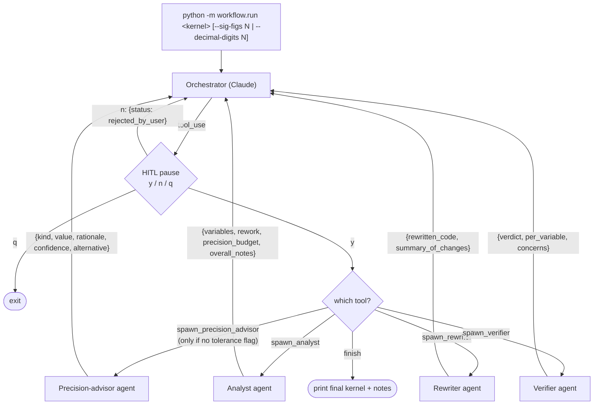
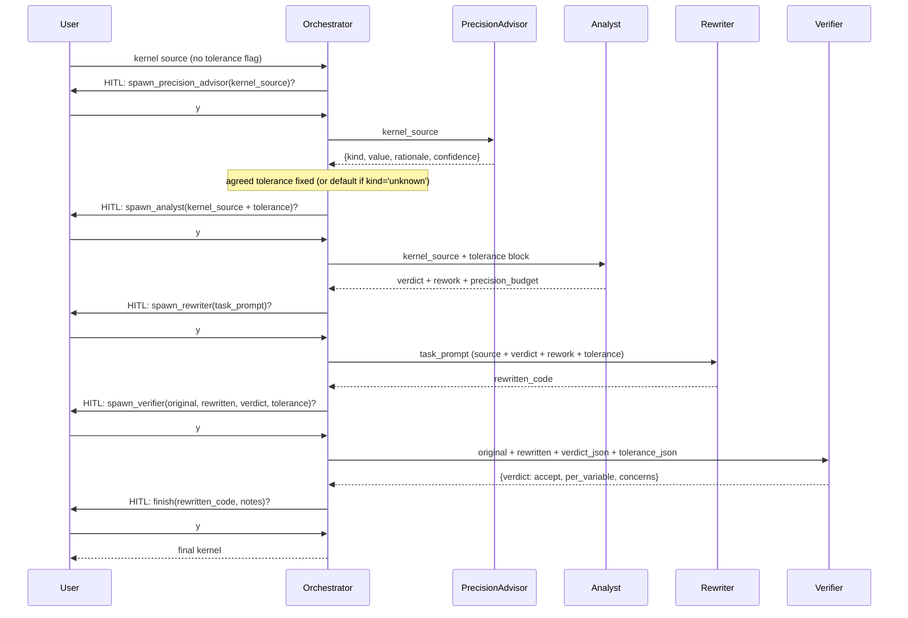

# Agent-Precision

An LLM orchestrator that rewrites numerical kernels (Kokkos C++ / CUDA) to
use less floating-point storage where it is safe to do so, given a
user-stated tolerance on the kernel's output precision.

**Why precision matters for throughput.** Modern GPUs accelerate `float`
much more than `double` (and accelerate narrower-than-`float` types more
still), while `double` performance has stagnated. Most scientific kernels
are written in `double` out of habit, not need: their inputs and outputs
don't carry enough significant figures to justify it. The cost of that
habit is throughput. This tool's job is to find the per-variable storage
type that satisfies the user's output-precision tolerance and no more.

This is a research prototype and a deliberate learning exercise in agent
orchestration and tool-calling. It is a single Python package (`workflow/`)
that talks to the Anthropic SDK. There is no build system and no CI. A
small Layer 1 test suite (`tests/`, run with `python -m pytest -q`) covers
the workflow plumbing with monkeypatched API calls; there is no Layer 2
evaluation of agent judgment yet. Features are added in small, observable
steps rather than as end-to-end machinery.

If you want to hack on the workflow itself, read `AGENTS.md` first — it
contains the gotchas (model id, env-loading, backend quirks) that will
otherwise burn you.

## Precision vocabulary

This project carefully distinguishes three things that are routinely
conflated in floating-point discussions:

- **Significant figures (`sig_figs`).** A *relative* tolerance on the
  kernel's output. `--sig-figs 6` means the rewritten kernel's output
  must agree with the original to roughly 6 significant figures
  (relative error below `1e-6`). Appropriate when the output spans many
  orders of magnitude (energies, forces, densities).
- **Decimal digits after the point (`decimal_digits`).** An *absolute*
  tolerance. `--decimal-digits 4` means the rewritten kernel's output
  must agree to roughly 4 decimal places (absolute error below `1e-4`).
  Appropriate when the output is bounded and you care about how close
  the digits are to the originals, not their relative size.
- **Floating-point storage precision (`float`, `double`, `float-float`,
  …).** How wide a variable is in memory and registers. A kernel can
  satisfy a 6-sig-fig output tolerance with a *mix* of storage
  precisions internally; that mix is exactly what the analyst chooses.

The tolerance is an **output**-precision target. Storage precision is the
**mechanism**. The analyst's job is to pick the cheapest mechanism that
meets the target.

## Status

What works today:

- Four-agent pipeline: **(precision_advisor →)? analyst → rewriter →
  verifier**, driven by an LLM orchestrator. The orchestrator's system
  prompt forbids calling `finish` unless the most recent verifier
  returned `verdict='accept'`.
- The user states the output-precision tolerance up front with
  `--sig-figs N` or `--decimal-digits N`. If neither flag is passed, the
  orchestrator runs the **precision_advisor** agent once to infer a
  tolerance from the kernel source. If the advisor returns
  `kind='unknown'` (it is allowed to refuse to guess), the orchestrator
  falls back to a documented default of `{sig_figs: 6,
  source: 'advisor_unknown_defaulted'}`.
- The agreed tolerance is threaded verbatim into the analyst, rewriter,
  and verifier task prompts. The analyst MUST return a `precision_budget`
  block linking its per-variable verdict to that tolerance; the verifier
  audits the budget.
- Analyst can choose between three per-variable methods —
  `downcast` (replace with a narrower hardware type, e.g. `double → float`
  — the throughput win), `emulate` (replace with a software-emulated
  pair, currently float-float / Dekker written inline as
  `struct ff_t {float hi, lo;}` — throughput-NEGATIVE; only justified
  when downcast violates tolerance), or `keep` — and can additionally
  suggest a kernel-shape `rework` such as Kahan summation.
- Human-in-the-loop pause before every agent call (`y` / `n` / `q`).
  Rejections are fed back to the orchestrator as
  `{"status": "rejected_by_user"}`, so it can self-correct without burning
  another agent call.
- Registry-driven agent definitions: adding a new agent type is one entry
  in `workflow/registry.py`; the generic runner does not change.
- Three execution backends: direct `api.anthropic.com`, Argo via local
  `argo-proxy`, and Argo via SSH tunnel + shim (fallback).

What is intentionally **not** here yet:

- The verifier is a **static / textual** check: it compares the rewritten
  code against the analyst's verdict for faithfulness. No mechanical
  verification.
- No compilation check, no accuracy check, no benchmark runner.
- No automated evaluation across the `test-kernels/` corpus.
- No framework (LangGraph etc.). See "Design notes" and "Roadmap" below.

## Run

Only dependency: `anthropic>=0.40.0`.

```bash
pip install -r requirements.txt
```

Stdout in every mode is the orchestrator's reasoning, then a HITL prompt
for each proposed tool call, then the final rewritten kernel and notes.

**Tolerance flags (optional, mutually exclusive).** Both Argo wrapper
scripts forward all extra arguments to `python -m workflow.run`.

```text
--sig-figs N         relative tolerance: ~N significant figures of agreement
--decimal-digits N   absolute tolerance: ~N decimal places of agreement
```

If neither flag is given, the orchestrator calls the `precision_advisor`
agent to infer one from the kernel source (see "Status" for the
`kind='unknown'` fallback).

**Direct (Anthropic API).** `.env` is not auto-loaded.

```bash
set -a; source .env; set +a            # exports ANTHROPIC_API_KEY etc.
python -m workflow.run test-kernels/kokkos/mixed/nbody_force.cpp --sig-figs 6
```

**Argo via local `argo-proxy` (recommended on Argonne hosts).** Requires
`argo-proxy serve` already running; no per-session Duo prompt.

```bash
./scripts/run-argoproxy.sh test-kernels/kokkos/mixed/nbody_force.cpp --decimal-digits 4
```

**Argo via SSH tunnel + shim (fallback).** Use when `argo-proxy` is not
installed on this host. Brings up its own tunnel and local Anthropic-
compatible shim.

```bash
./scripts/run-argo.sh test-kernels/kokkos/mixed/nbody_force.cpp
```

See `AGENTS.md` for the backend details (ports, model-id quirks, why both
Argo paths exist).

## Workflow

High-level flow. The orchestrator is itself a Claude conversation; its
tools are one per agent type plus a `finish` tool.



Edge enforcement: the `(precision_advisor →)? analyst → rewriter →
verifier → finish` order, the "no `finish` without `verdict='accept'`"
rule, and the "no `spawn_precision_advisor` if the user supplied a
tolerance" rule all live in the orchestrator's **system prompt**, not in
code. The HITL pause and the `MAX_TURNS=20` backstop are the only
code-level guardrails.

Intended happy path through the conversation when no tolerance flag is
passed (so the advisor is called once up front):



When `--sig-figs N` or `--decimal-digits N` is passed on the command
line, the first step (`spawn_precision_advisor`) is skipped — the
orchestrator's system prompt forbids calling the advisor when the user
supplied a tolerance.

On `verdict='reject'`, the orchestrator either re-spawns the rewriter
with a task prompt that incorporates the verifier's mismatches and
concerns, or — if those concerns implicate the analyst's verdict itself
— re-spawns the analyst. Either way, a fresh `spawn_verifier` must
return `accept` before `finish` is allowed.

## Agents

| Agent                | Model             | Input                                                                                       | Output (schema keys)                                                                                                                                                                                                                                            | Defined in                 |
| -------------------- | ----------------- | ------------------------------------------------------------------------------------------- | --------------------------------------------------------------------------------------------------------------------------------------------------------------------------------------------------------------------------------------------------------------- | -------------------------- |
| `precision_advisor`  | `claude-opus-4-7` | kernel source only                                                                          | `kind` (`sig_figs`/`decimal_digits`/`unknown`), `value`, `rationale`, `confidence` (`high`/`medium`/`low`), `alternative`                                                                                                                                       | `workflow/registry.py`     |
| `analyst`            | `claude-opus-4-7` | kernel source + tolerance block (`target_kind`, `target_value`, `source`)                   | `variables[{name, action, target_precision, emulation_type, reason}]`, `rework{suggested, transformation, rationale, affected_variables}`, `precision_budget{target_kind, target_value, source, claimed_output_precision, headroom_argument}`, `overall_notes` | `workflow/registry.py`     |
| `rewriter`           | `claude-opus-4-7` | `task_prompt` (source + verdict + any rework + tolerance, composed by orch.)                | `rewritten_code`, `summary_of_changes`                                                                                                                                                                                                                          | `workflow/registry.py`     |
| `verifier`           | `claude-opus-4-7` | original source, rewritten source, analyst verdict (JSON string), tolerance (JSON string)   | `verdict` (`accept`/`reject`), `per_variable[{name, expected_action, observed_action, ok}]`, `concerns`                                                                                                                                                         | `workflow/registry.py`     |
| `orchestrator`       | `claude-opus-4-7` | kernel path + source + optional tolerance (from CLI)                                        | one `finish(rewritten_code, notes)` call                                                                                                                                                                                                                        | `workflow/orchestrator.py` |

The analyst receives the kernel source only — no file path, no orchestrator
hints — so that ground-truth labels encoded in directory names cannot leak
into the verdict. The same holds for the precision_advisor.

The analyst is told the tolerance is a hard constraint, and that
`emulate` is throughput-negative and only justified when `downcast` would
violate that tolerance. The rewriter is forbidden from silently
substituting one method for another (e.g. downcasting when asked to
emulate), so the verifier's per-variable `ok` check has actual meaning.

## Orchestrator tools

| Tool                       | Purpose                       | Input                                                                                                                          | Returns to orchestrator                                                  |
| -------------------------- | ----------------------------- | ------------------------------------------------------------------------------------------------------------------------------ | ------------------------------------------------------------------------ |
| `spawn_precision_advisor`  | dispatch to precision_advisor | `kernel_source: string`                                                                                                        | advisor's structured output, or `{"status":"rejected_by_user"}`          |
| `spawn_analyst`            | dispatch to analyst           | `kernel_source: string` (must contain a labeled tolerance block: `target_kind`, `target_value`, `source`)                      | analyst's structured output, or `{"status":"rejected_by_user"}`          |
| `spawn_rewriter`           | dispatch to rewriter          | `task_prompt: string`                                                                                                          | rewriter's structured output, or `{"status":"rejected_by_user"}`         |
| `spawn_verifier`           | dispatch to verifier          | `original_source: string`, `rewritten_source: string`, `analyst_verdict_json: string`, `tolerance_json: string`                | verifier's structured output, or `{"status":"rejected_by_user"}`         |
| `finish`                   | end the workflow              | `rewritten_code`, `notes`                                                                                                      | (terminates; nothing fed back)                                           |

The orchestrator's system prompt enforces that `spawn_precision_advisor`
is called at most once, only when the CLI passed no tolerance, and only
before `spawn_analyst`. The Python `_execute_tool` does not police any
of this — it is trusted to the orchestrator LLM.

## Repo layout

- `workflow/`
  - `registry.py` — agent definitions (`AGENTS` dict: system prompt, output
    schema, model). Single source of truth.
  - `run_agent.py` — generic agent runner. Forces structured output via
    `tool_choice={"type":"tool","name":"submit_result"}` whose input schema
    is the registry entry's `output_schema`. Never edited per-agent.
  - `orchestrator.py` — router + HITL loop. One tool per agent type plus
    `finish`.
  - `run.py` — CLI entrypoint
    (`python -m workflow.run <kernel_file> [--sig-figs N | --decimal-digits N]`).
    Normalizes tolerance flags into `{kind, value, source='user_cli'}`
    or `None`, then hands off to the orchestrator.
- `test-kernels/` — 17 kernels under
  `{cuda,kokkos}/{lowerable,needs_precision,mixed}/`. Directory name is
  the ground-truth label and is **never** fed into agent prompts. Per-
  variable expected verdicts and test tolerances live in
  `test-kernels/SUMMARY.md` and are used for evaluating orchestrator
  output, not as input to it.
- `scripts/` — Argo backend wrappers (`run-argoproxy.sh`, `run-argo.sh`).
- `AGENTS.md` — instructions for coding agents working on this repo.
  Contains the gotchas you need before changing anything.
- `opencode.json` — opencode configuration. Unrelated to the workflow
  itself; only relevant if you run opencode against this repo.

## Design notes

**Why the user states the tolerance.** Output precision is a domain
judgment, not a numerical one. The author of a kernel knows whether 4
decimal places of agreement is fine or catastrophic; a model staring at
the source alone cannot know that without strong prior context. The CLI
flags make that judgment explicit and the orchestrator threads it through
every downstream agent verbatim, so there is no point in the pipeline
where the target silently drifts.

**Why a separate precision_advisor agent.** When the user does not
supply a tolerance, the next best thing is a single LLM call that *only*
infers a tolerance — not one that conflates tolerance-inference with
per-variable verdicts (which is the analyst's job). The advisor is also
allowed to return `kind='unknown'`, which is a feature: when the kernel
genuinely doesn't telegraph its output's precision needs, the orchestrator
falls back to a documented default (`{sig_figs: 6,
source: 'advisor_unknown_defaulted'}`) instead of acting on a confident-
sounding guess. The fallback rule lives in the orchestrator's system
prompt, not in Python, so the agent can be re-tuned without code changes.

**Why a separate analyst agent (vs a smarter rewriter).** Keeps the
rewriter mechanical — it transforms code to match an explicit verdict and
does not exercise numerical judgment. Makes the HITL pause informative,
because the verdict is human-readable structured data before any code is
touched. And it gives the verifier a structured artifact to check
against, separate from the code diff.

**Why the verifier is a separate (static) agent.** Faithfulness of the
rewrite to the verdict is a textual check the rewriter cannot honestly
self-report. Splitting it out also draws a clean line for future
mechanical verifiers (compile, run, compare): those will be orchestrator
**tools**, not new agents, because they are deterministic and shouldn't
burn an LLM call.

**Why HITL on every tool call.** This is a learning-by-watching tool, not
a production system. Seeing the exact prompt that is about to be sent to
each agent is most of the value. Rejection-as-self-correction
(`{"status":"rejected_by_user"}`) is a deliberately cheap feedback loop:
you can steer the orchestrator without spending an agent API call.

**Why the registry pattern.** Adding an agent type is one entry in
`AGENTS`. The orchestrator gains one new `spawn_*` tool wrapping it;
`run_agent.py` does not change. This is the constraint that keeps the
prototype small as new agent types are added.

**Why no framework (LangGraph etc.) yet.** Not enough nodes or edges to
justify it. The orchestrator is a single Claude conversation with a HITL
gate; that is easier to read in ~340 lines of Python than as a graph
config. Revisit only if we get parallel branches (e.g. multiple rewrite
candidates evaluated concurrently), async/durable state across long jobs
(see "JLSE / async toolchain" in `AGENTS.md`), or a non-CLI frontend.
Intermediate alternatives to try first: an explicit `OrchestratorState`
dataclass, or pickled-message resume.

## Roadmap

Authoritative list lives in `AGENTS.md` under "Planned next steps"; this
is a reader-facing summary.

1. **Dynamic verification stack.** Mechanical verifiers — compile the
   rewritten kernel, run it against a baseline, compare outputs within
   tolerance — exposed to the orchestrator as new **tools** (not new
   agents), with a `{status, stdout, stderr, artifacts}` return shape so
   the same interface survives migration to a remote batch system. Will
   likely require raising `MAX_TURNS` past 20.
2. **Baseline harness agent.** A one-shot LLM agent that, given the
   original kernel, writes a small driver + reference inputs + expected
   outputs. The mechanical verifier above runs the harness against both
   original and rewritten kernels. Generated once per kernel, reused on
   every rewrite attempt.
3. **JLSE / async toolchain migration.** Move compile/run from the local
   host to a remote scheduler. The verifier tool interfaces in (1) are
   designed so the orchestrator loop doesn't change when "run" becomes
   "submit job, poll, fetch artifacts".
4. **Emulation library upgrade.** v0 writes `struct ff_t {float hi, lo;}`
   plus Dekker two-sum/two-prod inline. Vendoring a real float-float
   header becomes safe once mechanical verification can catch regressions.
5. **Corpus evaluation.** Run the workflow across all 17 kernels in
   `test-kernels/` — feeding each kernel's expected tolerance from
   `test-kernels/SUMMARY.md` via `--sig-figs` / `--decimal-digits` — and
   compare the resulting per-variable verdicts and rework suggestions
   against the ground-truth labels in that file.

Explicitly **not** on the roadmap (see `AGENTS.md` for rationale):
multiple per-method analysts, and adopting LangGraph at this scale.
