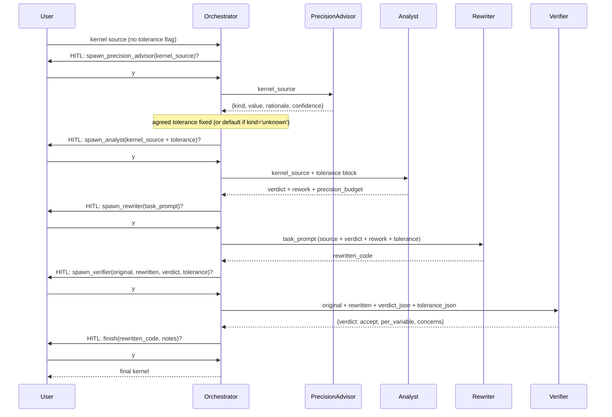

# Agent-Precision

An LLM orchestrator that rewrites numerical kernels (Kokkos C++ / CUDA) to
use less floating-point storage where it is safe to do so, given a
user-stated tolerance on the kernel's output precision.

**Why precision matters for throughput.** Modern GPUs accelerate `float`
much more than `double` (and accelerate narrower-than-`float` types more
still), while `double` performance has stagnated. Most scientific kernels
are written in `double` out of habit, not need: their inputs and outputs
don't carry enough significant figures to justify it. The cost of that
habit is throughput. This tool's job is to find the per-variable storage
type that satisfies the user's output-precision tolerance and no more.

This is a research prototype and a deliberate learning exercise in agent
orchestration and tool-calling. It is a single Python package (`workflow/`)
that talks to the Anthropic SDK. There is no build system and no CI. A
small Layer 1 test suite (`tests/`, run with `python -m pytest -q`) covers
the workflow plumbing with monkeypatched API calls; there is no Layer 2
evaluation of agent judgment yet. Features are added in small, observable
steps rather than as end-to-end machinery.

If you want to hack on the workflow itself, read `AGENTS.md` first — it
contains the gotchas (model id, env-loading, backend quirks) that will
otherwise burn you.

## Precision vocabulary

Three things this project keeps deliberately separate:

- **`sig_figs`** — *relative* tolerance on the kernel's output (`--sig-figs 6` ≈ relative error below `1e-6`).
- **`decimal_digits`** — *absolute* tolerance on the output (`--decimal-digits 4` ≈ absolute error below `1e-4`).
- **Storage precision** (`float`, `double`, `float-float`, …) — how wide a variable is in memory. A kernel can hit a sig-figs target using a *mix* of storage precisions; that mix is what the analyst chooses.

Tolerance is the **target**; storage precision is the **mechanism**.
Full plumbing details (the `{kind, value, source}` dict, the `source`
enum, how it flows through prompts) live in `AGENTS.md` under "Tolerance
vocabulary and plumbing".

## Status

What works today:

- Core pipeline `(precision_advisor →)? analyst → rewriter → verifier`; orchestrator forbids `finish` without `verdict='accept'`.
- Side artifact: `baseline_harness` — a fifth agent that, for Kokkos `.cpp` kernels only, emits a self-contained C++ driver to `baselines/<kernel_stem>/driver.cpp` that (when later compiled and run) writes a deterministic reference output to `./reference.json`. Not consumed by any other agent in this run; reserved for a future mechanical comparator. Not a precondition for `finish`.
- Tolerance from `--sig-figs` / `--decimal-digits`, else inferred by the advisor; advisor may return `kind='unknown'`, which triggers fallback `{sig_figs: 6, source: 'advisor_unknown_defaulted'}`.
- Tolerance threaded verbatim to analyst, rewriter, and verifier; analyst returns a `precision_budget` block; verifier audits it.
- Per-variable methods: `downcast` (narrower hardware type — the throughput win), `emulate` (software pair, currently inline float-float / Dekker — throughput-NEGATIVE; only when downcast violates tolerance), or `keep`. Analyst can additionally suggest a kernel-shape `rework` such as Kahan summation.
- HITL pause before every agent call (`y` / `n` / `q`); rejection feeds `{"status": "rejected_by_user"}` back so the orchestrator can self-correct.
- Registry-driven agent definitions: one entry in `workflow/registry.py` per agent type; the generic runner is untouched.
- Three execution backends: direct `api.anthropic.com`, Argo via local `argo-proxy`, and Argo via SSH tunnel + shim (fallback).

What is intentionally **not** here yet:

- Verifier is a **static / textual** check (faithfulness of code to verdict); no mechanical verification, no compile, no run, no benchmark. The baseline_harness emits the driver source but does not compile or execute it; a downstream mechanical comparator is still to come.
- No automated evaluation across the `test-kernels/` corpus.
- No framework (LangGraph etc.). See "Design notes" and "Roadmap".

## Run

Only dependency: `anthropic>=0.40.0`.

```bash
pip install -r requirements.txt
```

Stdout in every mode is the orchestrator's reasoning, then a HITL prompt
for each proposed tool call, then the final rewritten kernel and notes.

**Tolerance flags (optional, mutually exclusive).** Both Argo wrapper
scripts forward all extra arguments to `python -m workflow.run`.

```text
--sig-figs N         relative tolerance: ~N significant figures of agreement
--decimal-digits N   absolute tolerance: ~N decimal places of agreement
```

If neither flag is given, the orchestrator calls the `precision_advisor`
agent to infer one from the kernel source (see "Status" for the
`kind='unknown'` fallback).

**Direct (Anthropic API).** `.env` is not auto-loaded.

```bash
set -a; source .env; set +a            # exports ANTHROPIC_API_KEY etc.
python -m workflow.run test-kernels/kokkos/mixed/nbody_force.cpp --sig-figs 6
```

**Argo via local `argo-proxy` (recommended on Argonne hosts).** Requires
`argo-proxy serve` already running; no per-session Duo prompt.

```bash
./scripts/run-argoproxy.sh test-kernels/kokkos/mixed/nbody_force.cpp --decimal-digits 4
```

**Argo via SSH tunnel + shim (fallback).** Use when `argo-proxy` is not
installed on this host.

```bash
./scripts/run-argo.sh test-kernels/kokkos/mixed/nbody_force.cpp
```

See `AGENTS.md` for backend details (ports, model-id quirks, why both
Argo paths exist).

## Workflow

Intended happy path through the conversation when no tolerance flag is
passed (so the advisor is called once up front). For the corresponding
high-level flowchart (HITL branches, tool dispatch), see `flowchart.md`.



On `verdict='reject'`, the orchestrator either re-spawns the rewriter
with a task prompt that incorporates the verifier's mismatches and
concerns, or — if those concerns implicate the analyst's verdict itself
— re-spawns the analyst. Either way, a fresh `spawn_verifier` must
return `accept` before `finish` is allowed.

## Agents

| Agent                | Model             | Input                                                                                       | Output (schema keys)                                                                                                                                                                                                                                            | Defined in                 |
| -------------------- | ----------------- | ------------------------------------------------------------------------------------------- | --------------------------------------------------------------------------------------------------------------------------------------------------------------------------------------------------------------------------------------------------------------- | -------------------------- |
| `precision_advisor`  | `claude-opus-4-7` | kernel source only                                                                          | `kind` (`sig_figs`/`decimal_digits`/`unknown`), `value`, `rationale`, `confidence` (`high`/`medium`/`low`), `alternative`                                                                                                                                       | `workflow/registry.py`     |
| `analyst`            | `claude-opus-4-7` | kernel source + tolerance block (`target_kind`, `target_value`, `source`)                   | `variables[{name, action, target_precision, emulation_type, reason}]`, `rework{suggested, transformation, rationale, affected_variables}`, `precision_budget{target_kind, target_value, source, claimed_output_precision, headroom_argument}`, `overall_notes` | `workflow/registry.py`     |
| `rewriter`           | `claude-opus-4-7` | `task_prompt` (source + verdict + any rework + tolerance, composed by orch.)                | `rewritten_code`, `summary_of_changes`                                                                                                                                                                                                                          | `workflow/registry.py`     |
| `verifier`           | `claude-opus-4-7` | original source, rewritten source, analyst verdict (JSON string), tolerance (JSON string)   | `verdict` (`accept`/`reject`), `per_variable[{name, expected_action, observed_action, ok}]`, `concerns`                                                                                                                                                         | `workflow/registry.py`     |
| `baseline_harness`   | `claude-opus-4-7` | original Kokkos C++ kernel source (Kokkos `.cpp` only; orchestrator skips for `.cu`)        | `driver_source`, `kernel_function_name`, `inputs_summary`, `output_arrays`                                                                                                                                                                                      | `workflow/registry.py`     |
| `orchestrator`       | `claude-opus-4-7` | kernel path + source + optional tolerance (from CLI) + optional `kernel_name`               | one `finish(rewritten_code, notes)` call                                                                                                                                                                                                                        | `workflow/orchestrator.py` |

The analyst receives the kernel source only — no file path, no orchestrator
hints — so that ground-truth labels encoded in directory names cannot leak
into the verdict. The same holds for the precision_advisor.

The analyst is told the tolerance is a hard constraint, and that
`emulate` is throughput-negative and only justified when `downcast` would
violate that tolerance. The rewriter is forbidden from silently
substituting one method for another (e.g. downcasting when asked to
emulate), so the verifier's per-variable `ok` check has actual meaning.

The `baseline_harness` is orthogonal to the analyst → rewriter → verifier
pipeline: it is invited (by the initial user message's BASELINE STEP
block) for Kokkos `.cpp` inputs only, called at most once per run, and
its output is a driver source that the operator compiles and runs out of
band. The driver pins `Kokkos::Serial` and a fixed RNG seed (42 by
default) so the reference output is reproducible. See `AGENTS.md`
("Baseline harness (side artifact)") for the full scope.

## Orchestrator tools

| Tool                       | Purpose                       | Input                                                                                                                          | Returns to orchestrator                                                  |
| -------------------------- | ----------------------------- | ------------------------------------------------------------------------------------------------------------------------------ | ------------------------------------------------------------------------ |
| `spawn_precision_advisor`  | dispatch to precision_advisor | `kernel_source: string`                                                                                                        | advisor's structured output, or `{"status":"rejected_by_user"}`          |
| `spawn_analyst`            | dispatch to analyst           | `kernel_source: string` (must contain a labeled tolerance block: `target_kind`, `target_value`, `source`)                      | analyst's structured output, or `{"status":"rejected_by_user"}`          |
| `spawn_rewriter`           | dispatch to rewriter          | `task_prompt: string`                                                                                                          | rewriter's structured output, or `{"status":"rejected_by_user"}`         |
| `spawn_verifier`           | dispatch to verifier          | `original_source: string`, `rewritten_source: string`, `analyst_verdict_json: string`, `tolerance_json: string`                | verifier's structured output, or `{"status":"rejected_by_user"}`         |
| `spawn_baseline_harness`   | dispatch to baseline_harness  | `kernel_source: string`, `kernel_stem: string` (Kokkos `.cpp` only; at most once per run)                                      | harness output + `driver_path` (orchestrator writes `baselines/<kernel_stem>/driver.cpp`), or `{"status":"rejected_by_user"}` |
| `finish`                   | end the workflow              | `rewritten_code`, `notes`                                                                                                      | (terminates; nothing fed back)                                           |

The orchestrator's system prompt enforces that `spawn_precision_advisor`
is called at most once, only when the CLI passed no tolerance, and only
before `spawn_analyst`; and that `spawn_baseline_harness` is called at
most once and only for Kokkos `.cpp` inputs. The Python `_execute_tool`
does not police any of this — it is trusted to the orchestrator LLM. The
one exception is the filesystem write for `spawn_baseline_harness`: the
driver path is computed from the orchestrator-supplied `kernel_stem`
(not from the agent's output), so a misbehaving agent cannot redirect
the write.

## Repo layout

- `workflow/`
  - `registry.py` — agent definitions (`AGENTS` dict: system prompt, output
    schema, model). Single source of truth.
  - `run_agent.py` — generic agent runner. Forces structured output via
    `tool_choice={"type":"tool","name":"submit_result"}` whose input schema
    is the registry entry's `output_schema`. Never edited per-agent.
  - `orchestrator.py` — router + HITL loop. One tool per agent type plus
    `finish`.
  - `run.py` — CLI entrypoint
    (`python -m workflow.run <kernel_file> [--sig-figs N | --decimal-digits N]`).
    Normalizes tolerance flags into `{kind, value, source='user_cli'}`
    or `None`, then hands off to the orchestrator.
- `test-kernels/` — 17 kernels under
  `{cuda,kokkos}/{lowerable,needs_precision,mixed}/`. Directory name is
  the ground-truth label and is **never** fed into agent prompts. Per-
  variable expected verdicts and test tolerances live in
  `test-kernels/SUMMARY.md` and are used for evaluating orchestrator
  output, not as input to it.
- `baselines/` — generated per-kernel driver sources from
  `baseline_harness` runs (`baselines/<kernel_stem>/driver.cpp`).
  Gitignored.
- `scripts/` — Argo backend wrappers (`run-argoproxy.sh`, `run-argo.sh`).
- `flowchart.md` — high-level orchestrator flowchart (HITL branches,
  tool dispatch); a companion to the sequence diagram above.
- `AGENTS.md` — instructions for coding agents working on this repo.
  Contains the gotchas you need before changing anything.
- `opencode.json` — opencode configuration. Unrelated to the workflow
  itself; only relevant if you run opencode against this repo.

## Design notes

**Why the user states the tolerance.** Output precision is a domain
judgment, not a numerical one. CLI flags make it explicit and the
orchestrator threads it through every downstream agent verbatim, so the
target never silently drifts.

**Why a separate precision_advisor agent.** When the user gives no
tolerance, a single LLM call that *only* infers one is cleaner than
folding that inference into the analyst's per-variable verdict. The
advisor is allowed to return `kind='unknown'`; the orchestrator then
falls back to a documented default (`{sig_figs: 6,
source: 'advisor_unknown_defaulted'}`) rather than acting on a
confident-sounding guess. Fallback rule lives in the orchestrator's
system prompt, not in Python.

**Why a separate analyst agent (vs a smarter rewriter).** Keeps the
rewriter mechanical, makes the HITL pause informative (structured
verdict before code is touched), and gives the verifier a structured
artifact to check against.

**Why the verifier is a separate (static) agent.** Faithfulness of the
rewrite to the verdict is a textual check the rewriter cannot honestly
self-report. Splitting it out also draws a clean line for future
mechanical verifiers (compile, run, compare), which will be orchestrator
**tools**, not new agents.

Two further "why" notes — **why HITL on every tool call** and **why the
registry pattern** — are covered in `AGENTS.md` under "Architecture".
LangGraph (and similar frameworks) are not adopted yet for the reasons
in "Roadmap" below; see `AGENTS.md` for the full rationale.

## Roadmap

Authoritative list lives in `AGENTS.md` under "Planned next steps"; this
is a reader-facing summary.

1. **Dynamic verification stack** — mechanical compile/run/compare as orchestrator tools, consuming the `baseline_harness` driver as the reference.
2. **Kernel-extractor agent** — slice a single target kernel out of a multi-kernel translation unit before analyst + baseline_harness run.
3. **JLSE / async toolchain migration** — move compile/run to a remote scheduler.
4. **Emulation library upgrade** — replace inline Dekker float-float with a vendored header.
5. **Corpus evaluation** — run the workflow across all 17 `test-kernels/`, feeding each kernel's expected tolerance from `test-kernels/SUMMARY.md`, and compare verdicts against ground-truth labels.

Explicitly **not** on the roadmap (see `AGENTS.md` for rationale):
multiple per-method analysts, and adopting LangGraph at this scale.
