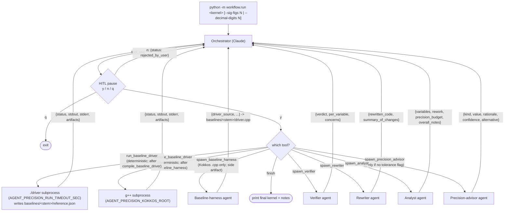

# Orchestrator flowchart

High-level view of the orchestrator loop. The orchestrator is a Claude
conversation; its tools are one per agent type plus `finish`. Every
proposed tool call passes through a human-in-the-loop pause (`y`/`n`/`q`)
before it runs. Rejection (`n`) is fed back to the orchestrator as
`{"status": "rejected_by_user"}` so it can self-correct without burning
another agent API call; quit (`q`) exits the loop.

For the intended happy-path *sequence* through the conversation (who
speaks when, including HITL turns), see the sequence diagram in
`README.md` under "Workflow". For pipeline rules (advisor at most once,
no `finish` without `verdict='accept'`, etc.) see `AGENTS.md`.
