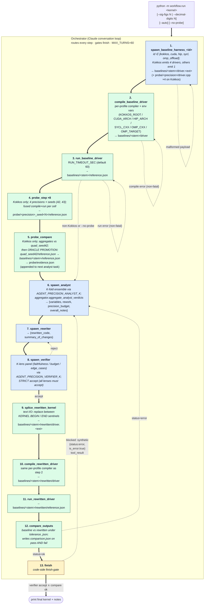

# Orchestrator flowchart

The orchestrator is a single Claude conversation that drives an
agent-and-deterministic-tool pipeline from kernel source to a
verified, lower-precision rewrite. Tool calls execute as the
orchestrator issues them; under `--auto` every executed tool is also
journaled to `baselines/<kernel_stem>/orchestrator_trace.jsonl`.

The diagram below shows the orchestrator as a subgraph whose interior
is the **happy path** — the 13-step chain for a Kokkos `.cpp` kernel
when `--no-probe` is not passed (probe pipeline runs between baseline
and analyst). Error and reject branches are summarized as side-loops
off the relevant nodes rather than redrawn for every step; the
deterministic finish-gate (verifier accept ∧ comparator ok) is the
single exit. The same diagram appears in `README.md` under
"Workflow"; this file adds the prose notes on each deviation branch
below. For pipeline rules (finish-gate semantics, probe-pipeline
gating, oracle promotion) see `AGENTS.md`.

The same shape applies to CUDA, HIP, SYCL, and OpenMP-offload — only
steps 4–5 (`probe_step ×8` and `probe_compare`) are skipped on
profiles with empty `probe_precisions` (currently all non-Kokkos
profiles), shortening the chain to 11 steps; the
`spawn_baseline_harness_<id>` agent variant, driver file extension
(`.cu` / `.hip` / `.cpp`), and compiler invoked in steps 2 / 10 are
the only other differences.

Legend: **blue** = LLM agent call (one entry per agent type in
`workflow/registry.py`); **green** = deterministic non-LLM tool
defined in `workflow/tools.py`; **yellow** = decision / gate. Solid
thick arrows (`==>`) are the happy path; dotted thin arrows are the
documented deviations (verifier reject, comparator mismatch, non-
fatal compile / run errors on the baseline chain, and the finish-
gate's synthetic-error retry).

## Notes on the deviations

The dotted-arrow side-loops are deliberately schematic — they show
which node the orchestrator typically returns to on each failure
class, not every possible retry path. The full rules:

- **Step 8 reject → step 7 (rewriter)**. The verifier's `concerns`
  list is fed back into the next `spawn_rewriter` task so the
  rewriter can address them directly; the analyst's verdict from
  step 6 is reused. After one retry the orchestrator may instead
  loop back to step 6 (`spawn_analyst`) if the verifier's concerns
  suggest the verdict itself was wrong.
- **Step 12 mismatch → step 6 (analyst)**. By system-prompt
  convention and `_FinishGateState` design, a numerical mismatch
  after a verifier accept means the verifier was over-permissive;
  the right response is a fresh analyst verdict, not just another
  rewrite of the same verdict. The synthetic
  `{status:'error', is_error:true}` tool result that blocks a
  premature `finish` call uses the same routing.
- **Step 1 error**. If the baseline-harness payload is malformed
  (missing both `drivers` and `driver_source`) the orchestrator
  raises a `RuntimeError` and the run ends.
- **Steps 2 / 3 errors are non-fatal to the pipeline**. The chain
  stalls (downstream steps that need `reference.json` cannot run),
  but the orchestrator does not abort — `finish` is still reachable
  on profiles without `dynamic_verification`. On Kokkos /
  CUDA / HIP / SYCL / OMP-offload (all `dynamic_verification=True`
  today), the chain stall transitively blocks `finish` via
  `_FinishGateState`'s `requires_comparator` check.
- **MAX_TURNS=60**. The only hard backstop against runaway loops.
  Raised from 40 to leave headroom for the probe pipeline (up to 9
  extra tool calls per Kokkos run) plus one verifier-retry cycle.

## Keeping this in sync

Nothing in `workflow/` reads this file — it is documentation only —
but if you change the pipeline (add or remove a spawn tool, change
the finish-gate, add a language profile that alters step counts),
update `flowchart.md`, the copy of this diagram in `README.md`
under "Workflow", and the relevant sections of `AGENTS.md` in the
same change so they do not drift.
