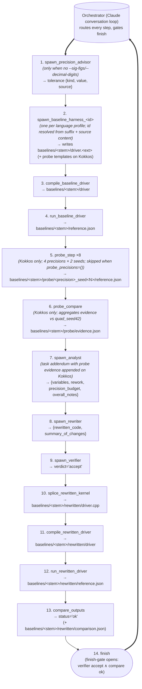

# Orchestrator flowchart

High-level view of the orchestrator loop. The orchestrator is a Claude
conversation; its tools are one per agent type plus `finish`. Every
proposed tool call passes through a human-in-the-loop pause (`y`/`n`/`q`)
before it runs. Rejection (`n`) is fed back to the orchestrator as
`{"status": "rejected_by_user"}` so it can self-correct without burning
another agent API call; quit (`q`) exits the loop. `--auto` skips the
pause entirely (every tool is auto-approved) and writes a JSONL trace
of every executed tool to
`baselines/<kernel_stem>/orchestrator_trace.jsonl`; user rejections
cannot occur in that mode.

```mermaid
flowchart TD
  U["python -m workflow.run &lt;kernel&gt; [--sig-figs N | --decimal-digits N] [--auto] [--no-probe]"] --> O["Orchestrator (Claude)"]
  O -- "tool_use" --> H{"HITL pause<br/>y / n / q<br/>(skipped under --auto;<br/>writes trace.jsonl)"}
  H -- "n: {status: rejected_by_user}" --> O
  H -- "q" --> X(["exit"])
  H -- "y / auto" --> D{"which tool?"}
  D -- "spawn_precision_advisor<br/>(only if no tolerance flag)" --> P["Precision-advisor agent"]
  D -- "spawn_analyst" --> A["Analyst agent<br/>(K-fold ensemble via<br/>AGENT_PRECISION_ANALYST_K;<br/>aggregator.aggregate_analyst_verdicts)"]
  D -- "spawn_rewriter" --> R["Rewriter agent"]
  D -- "spawn_verifier" --> V["Verifier agent<br/>(K-lens panel via<br/>AGENT_PRECISION_VERIFIER_K;<br/>verifier_panel.aggregate_verifier_verdicts)"]
  D -- "spawn_baseline_harness_&lt;id&gt;<br/>(one per language profile;<br/>id ∈ {kokkos, cuda, hip, sycl, omp_offload})" --> B["Baseline-harness agent<br/>(per-profile system prompt)"]
  D -- "compile_baseline_driver<br/>(deterministic; after baseline_harness)" --> C["compiler subprocess<br/>(per profile: g++/nvcc/hipcc/icpx/clang++;<br/>AGENT_PRECISION_KOKKOS_ROOT / CUDA_ARCH /<br/>HIP_ARCH / SYCL_CXX / OMP_CXX / OMP_TARGET)"]
  D -- "run_baseline_driver<br/>(deterministic; after compile_baseline_driver)" --> N["./driver subprocess<br/>(AGENT_PRECISION_RUN_TIMEOUT_SEC)<br/>writes baselines/&lt;stem&gt;/reference.json"]
  D -- "splice_rewritten_kernel<br/>(deterministic; after verifier accept + run_baseline_driver)" --> S["text I/O: replace between<br/>KERNEL BEGIN / END sentinels<br/>writes baselines/&lt;stem&gt;/rewritten/driver.&lt;ext&gt;<br/>(.cpp for kokkos/sycl/omp_offload, .cu for cuda, .hip for hip)"]
  D -- "compile_rewritten_driver<br/>(deterministic; after splice)" --> CR["compiler subprocess<br/>(same per-profile compiler as baseline)<br/>writes baselines/&lt;stem&gt;/rewritten/driver"]
  D -- "run_rewritten_driver<br/>(deterministic; after compile_rewritten_driver)" --> NR["./driver subprocess<br/>(AGENT_PRECISION_RUN_TIMEOUT_SEC)<br/>writes baselines/&lt;stem&gt;/rewritten/reference.json"]
  D -- "compare_outputs<br/>(deterministic; after run_rewritten_driver)" --> CMP["arithmetic + file I/O:<br/>diff baseline vs rewritten reference.json<br/>under tolerance_json<br/>writes baselines/&lt;stem&gt;/rewritten/comparison.json"]
  D -- "probe_step<br/>(deterministic; Kokkos only;<br/>after run_baseline_driver; 8 calls = 4 precisions × 2 seeds)" --> PS["compile + run subprocess<br/>(reuses _compile_driver / _run_driver)<br/>writes baselines/&lt;stem&gt;/probe/&lt;precision&gt;_seed&lt;N&gt;/reference.json"]
  D -- "probe_compare<br/>(deterministic; after probe_step ×8)" --> PC["file I/O: aggregate per-cell references<br/>against quad_seed42 ground truth<br/>writes baselines/&lt;stem&gt;/probe/evidence.json<br/>(consumed by next spawn_analyst as task addendum)"]
  D -- "finish" --> G{"finish-gate<br/>(code-side)"}
  G -- "verifier accept AND compare_outputs ok<br/>(for any profile with dynamic_verification=True;<br/>currently all five)" --> F(["print final kernel + notes"])
  G -- "blocked: synthetic {status:'error', is_error:true} tool_result<br/>(comparator error → prefer spawn_analyst on retry)" --> O
  P -- "{kind, value, rationale, confidence, alternative}" --> O
  A -- "{variables, rework, precision_budget, overall_notes}" --> O
  R -- "{rewritten_code, summary_of_changes}" --> O
  V -- "{verdict, per_variable, concerns}" --> O
  B -- "{driver_source, ...} -> baselines/&lt;stem&gt;/driver.cpp" --> O
  C -- "{status, stdout, stderr, artifacts}" --> O
  N -- "{status, stdout, stderr, artifacts}" --> O
  S -- "{status, stdout, stderr, artifacts}" --> O
  CR -- "{status, stdout, stderr, artifacts}" --> O
  NR -- "{status, stdout, stderr, artifacts}" --> O
  CMP -- "{status, stdout, stderr, artifacts}" --> O
  PS -- "{status, stdout, stderr, artifacts}" --> O
  PC -- "{status, stdout, stderr, artifacts}" --> O
```

For the intended happy-path *sequence* through the conversation (who
speaks when, including HITL turns), see the sequence diagram in
`README.md` under "Workflow". For pipeline rules (advisor at most once,
finish-gate semantics, etc.) see `AGENTS.md`.

## Happy path

The 14-step chain through the orchestrator for a Kokkos `.cpp` kernel
when no tolerance flag is passed (so the advisor runs once up front and
the full dynamic-verification chain runs at the end), and `--no-probe`
is not passed (so the probe pipeline runs between the baseline chain
and the analyst). Every step is routed by the orchestrator loop — the
agent or deterministic tool returns its result to the orchestrator,
which then issues the next tool call. Errors, rejections, and verifier
`reject` branches are deliberately omitted here; see the top-level
flowchart above for those. The same shape applies to CUDA, HIP, SYCL,
and OpenMP-offload — except that steps 5–6 (probe_step ×8 and
probe_compare) are skipped on profiles with empty `probe_precisions`
(currently all non-Kokkos profiles), shortening the chain to 12 steps.
Only step 2's `spawn_baseline_harness_<id>` agent, the driver file
extension (`.cu` / `.hip` / `.cpp`), and the compiler invoked in steps
3 and 11 change.

