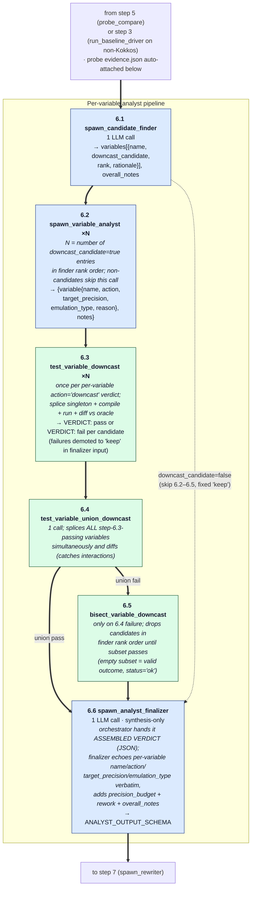

# Orchestrator flowchart

The orchestrator is a single Claude conversation that drives an
agent-and-deterministic-tool pipeline from kernel source to a
verified, lower-precision rewrite. Tool calls execute as the
orchestrator issues them; under `--auto` every executed tool is also
journaled to `baselines/<kernel_stem>/orchestrator_trace.jsonl`.

The diagram below shows the orchestrator as a subgraph whose interior
is the **happy path** — the 13-step chain for a Kokkos `.cpp` kernel
when `--no-probe` is not passed (probe pipeline runs between baseline
and the per-variable analyst pipeline). Step 6 (`per-variable analyst
pipeline`) is a collapsed subgraph in itself — see "The per-variable
analyst pipeline (step 6)" below for its internal shape. Error and
reject branches are summarized as side-loops off the relevant nodes
rather than redrawn for every step; the deterministic finish-gate
(verifier accept ∧ comparator ok) is the single exit. The same
diagram appears in `README.md` under "Workflow"; this file adds the
prose notes on each deviation branch below. For pipeline rules
(finish-gate semantics, probe-pipeline gating, oracle promotion) see
`AGENTS.md`.

The same shape applies to CUDA, HIP, SYCL, and OpenMP-offload — only
steps 4–5 (`probe_step ×8` and `probe_compare`) are skipped on
profiles with empty `probe_precisions` (currently all non-Kokkos
profiles), shortening the chain to 11 steps; the
`spawn_baseline_harness_<id>` agent variant, driver file extension
(`.cu` / `.hip` / `.cpp`), and compiler invoked in steps 2 / 10 are
the only other differences.

```mermaid
flowchart TD
  U["python -m workflow.run &lt;kernel&gt;<br/>[--sig-figs N | --decimal-digits N]<br/>[--auto] [--no-probe]"]
  F(["print final kernel + notes"])

  U ==> Orch

  subgraph Orch ["Orchestrator (Claude conversation loop)<br/>routes every step · gates finish · MAX_TURNS=150"]
    direction TB

    S1["<b>1. spawn_baseline_harness_&lt;id&gt;</b><br/><i>id ∈ {kokkos, cuda, hip, sycl, omp_offload};<br/>Kokkos emits 4 drivers, others emit 1</i><br/>→ baselines/&lt;stem&gt;/driver.&lt;ext&gt;<br/>(+ probe/&lt;precision&gt;/driver.cpp ×4 on Kokkos)"]:::agent
    S2["<b>2. compile_baseline_driver</b><br/>per-profile compiler + env vars<br/>(KOKKOS_ROOT / CUDA_ARCH / HIP_ARCH /<br/>SYCL_CXX / OMP_CXX / OMP_TARGET)<br/>→ baselines/&lt;stem&gt;/driver"]:::det
    S3["<b>3. run_baseline_driver</b><br/>RUN_TIMEOUT_SEC (default 60)<br/>→ baselines/&lt;stem&gt;/reference.json"]:::det
    S4["<b>4. probe_step ×8</b><br/><i>Kokkos only; 4 precisions × seeds {42, 43};<br/>fused compile+run per cell</i><br/>→ probe/&lt;precision&gt;_seed&lt;N&gt;/reference.json"]:::det
    S5["<b>5. probe_compare</b><br/><i>Kokkos only; aggregates vs quad_seed42;<br/>then ORACLE PROMOTION:<br/>quad_seed42/reference.json →<br/>baselines/&lt;stem&gt;/reference.json</i><br/>→ probe/evidence.json<br/>(appended to next analyst task)"]:::det
    S6["<b>6. per-variable analyst pipeline</b><br/><i>spawn_candidate_finder → N × spawn_variable_analyst<br/>→ N × test_variable_downcast → test_variable_union_downcast<br/>→ bisect_variable_downcast → spawn_analyst_finalizer</i><br/>→ {variables, rework, precision_budget,<br/>overall_notes} (ANALYST_OUTPUT_SCHEMA)"]:::agent
    S7["<b>7. spawn_rewriter</b><br/>→ {rewritten_code, summary_of_changes}"]:::agent
    S8["<b>8. spawn_verifier</b><br/><i>K-lens panel (faithfulness / budget / edge_cases)<br/>via AGENT_PRECISION_VERIFIER_K;<br/>STRICT accept (all lenses must accept)</i>"]:::agent
    S9["<b>9. splice_rewritten_kernel</b><br/><i>text I/O: replace between<br/>KERNEL BEGIN / END sentinels</i><br/>→ baselines/&lt;stem&gt;/rewritten/driver.&lt;ext&gt;"]:::det
    S10["<b>10. compile_rewritten_driver</b><br/>same per-profile compiler as step 2<br/>→ baselines/&lt;stem&gt;/rewritten/driver"]:::det
    S11["<b>11. run_rewritten_driver</b><br/>→ baselines/&lt;stem&gt;/rewritten/reference.json"]:::det
    S12["<b>12. compare_outputs</b><br/><i>baseline vs rewritten under tolerance_json;<br/>writes comparison.json on pass AND fail</i>"]:::det
    S13["<b>13. finish</b><br/><i>code-side finish-gate</i>"]:::gate

    S1 ==> S2;
    S2 ==> S3;
    S3 ==> S4;
    S4 ==> S5;
    S5 ==> S6;
    S3 -. "non-Kokkos or --no-probe" .-> S6;
    S6 ==> S7;
    S7 ==> S8;
    S8 == "accept" ==> S9;
    S9 ==> S10;
    S10 ==> S11;
    S11 ==> S12;
    S12 == "status=ok" ==> S13;

    %% deviations from the happy path, as compact side-loops
    S8 -. "reject" .-> S7;
    S12 -. "status=error" .-> S6;
    S1 -. "malformed payload" .-> S1;
    S2 -. "compile error (non-fatal)" .-> S2;
    S3 -. "run error (non-fatal)" .-> S3;
  end

  S13 == "verifier accept ∧ compare ok" ==> F
  S13 -. "blocked: synthetic<br/>{status:error,<br/>is_error:true}<br/>tool_result" .-> S6

  classDef agent fill:#dbeafe,stroke:#1e3a8a,stroke-width:1px,color:#0f172a
  classDef det fill:#dcfce7,stroke:#14532d,stroke-width:1px,color:#0f172a
  classDef gate fill:#fef3c7,stroke:#78350f,stroke-width:1px,color:#0f172a
```

Legend: **blue** = LLM agent call (one entry per agent type in
`workflow/registry.py`); **green** = deterministic non-LLM tool
defined in `workflow/tools.py`; **yellow** = decision / gate. Solid
thick arrows (`==>`) are the happy path; dotted thin arrows are the
documented deviations (verifier reject, comparator mismatch, non-
fatal compile / run errors on the baseline chain, and the finish-
gate's synthetic-error retry).

## Notes on the deviations

The dotted-arrow side-loops are deliberately schematic — they show
which node the orchestrator typically returns to on each failure
class, not every possible retry path. The full rules:

- **Step 8 reject → step 7 (rewriter)**. The verifier's `concerns`
  list is fed back into the next `spawn_rewriter` task so the
  rewriter can address them directly; the assembled verdict from
  step 6 is reused. After one retry the orchestrator may instead
  loop back into the step-6 pipeline (typically re-running
  `spawn_analyst_finalizer`, or re-running individual
  `spawn_variable_analyst` calls) if the verifier's concerns
  suggest the per-variable verdict itself was wrong.
- **Step 12 mismatch → step 6 (analyst pipeline)**. By system-prompt
  convention and `_FinishGateState` design, a numerical mismatch
  after a verifier accept means the verifier was over-permissive;
  the right response is fresh analyst work (typically re-running
  `spawn_candidate_finder` and rebuilding the verdict from
  scratch), not just another rewrite of the same verdict. The
  synthetic `{status:'error', is_error:true}` tool result that
  blocks a premature `finish` call uses the same routing.
- **Step 1 error**. If the baseline-harness payload is malformed
  (missing both `drivers` and `driver_source`) the orchestrator
  raises a `RuntimeError` and the run ends.
- **Steps 2 / 3 errors are non-fatal to the pipeline**. The chain
  stalls (downstream steps that need `reference.json` cannot run),
  but the orchestrator does not abort — `finish` is still reachable
  on profiles without `dynamic_verification`. On Kokkos /
  CUDA / HIP / SYCL / OMP-offload (all `dynamic_verification=True`
  today), the chain stall transitively blocks `finish` via
  `_FinishGateState`'s `requires_comparator` check.
- **MAX_TURNS=150**. The only hard backstop against runaway loops.
  Raised from 60 to leave headroom for the per-variable analyst
  pipeline: for a kernel with ~10 downcast candidates the pipeline
  adds ~22 extra tool calls to the happy path (~31 total for the
  analyst-side pipeline plus ~11 for the probe/baseline chain =
  ~42), plus headroom for one or two verifier-driven
  finalizer-rerun cycles and for kernels with larger candidate
  counts. 150 gives roughly 3× margin above the happy-path
  estimate.

## The per-variable analyst pipeline (step 6)

Step 6 collapses a six-stage subgraph — three LLM agents and three
deterministic tools, interleaved so every LLM verdict on a downcast
candidate is empirically gated against the compiled driver before
the finalizer synthesizes the full `ANALYST_OUTPUT_SCHEMA` object
the rewriter and verifier consume.

Same legend as the top-level diagram: **blue** = LLM agent call,
**green** = deterministic tool. Solid thick arrows are the happy
path; dotted thin arrows are documented deviations.

In order:

1. **`spawn_candidate_finder`** (LLM, once) — triage: returns a ranked
   `{name, downcast_candidate, rank, rationale}` list covering every
   named floating-point variable in the kernel. If the probe ran,
   its `evidence.json` is auto-attached to the task by the
   orchestrator.
2. **`spawn_variable_analyst`** (LLM, once per `downcast_candidate=true`
   entry, in rank order) — per-variable verdict:
   `{name, action, target_precision, emulation_type, reason}` plus
   optional `notes`. Probe evidence is auto-attached to each call.
   Non-candidate variables (`downcast_candidate=false` from the
   finder) skip the LLM call and get a fixed
   `{action:'keep', reason:'not a downcast candidate per finder: <rationale>'}`.
3. **`test_variable_downcast`** (deterministic, once per per-variable
   `action='downcast'` verdict) — empirical singleton test: splices
   just that one variable at the requested target precision into
   the baseline driver, compiles, runs, and diffs against the
   oracle under the operator-supplied tolerance. Mismatch is
   `status='ok'` with `VERDICT: fail` in stdout — infra failures
   (compile error, timeout, missing artifact) get `status='error'`.
   Variables whose singleton test fails are demoted to `keep` in
   step 4.
4. **`test_variable_union_downcast`** (deterministic, once) — empirical
   union test: splices every step-3-passing variable *simultaneously*
   and diffs. Catches interactions the singleton tests can't see.
5. **`bisect_variable_downcast`** (deterministic, conditional on union
   failure) — drops candidates in candidate-finder rank order until
   the remaining subset passes. Also returns `status='ok'` on empty
   passed-subset (all downcasts dropped is a valid outcome, not an
   error).
6. **`spawn_analyst_finalizer`** (LLM, once) — synthesis-only: takes the
   orchestrator-assembled `variables[]` verdict (produced from
   steps 1–5) plus the kernel source and probe evidence, and adds
   the `precision_budget`, `rework`, and `overall_notes` blocks that
   downstream (rewriter, verifier) need. It **must not** change per-
   variable `name / action / target_precision / emulation_type`, and
   cannot add or drop entries — this is enforced by the finalizer's
   system prompt and audited by unit tests. Rework (Kahan
   summation etc.) is decided here from the source; usually
   `suggested=false`.

The finalizer's output conforms to `ANALYST_OUTPUT_SCHEMA` verbatim,
so nothing downstream (rewriter, verifier, `_FinishGateState`) needs
to know the pipeline replaced a single monolithic `spawn_analyst`.
There is no post-analyst probe-consistency gate in this pipeline;
step 3 (`test_variable_downcast`) is the empirical replacement, and
the historical `_probe_consistency_gate` and its call sites were
removed in Step 5b. `check_analyst_verdict_against_probe` is
retained in `workflow/tools.py` for its unit tests and any future
callers.

## Keeping this in sync

Nothing in `workflow/` reads this file — it is documentation only —
but if you change the pipeline (add or remove a spawn tool, change
the finish-gate, add a language profile that alters step counts),
update `flowchart.md`, the copy of this diagram in `README.md`
under "Workflow", and the relevant sections of `AGENTS.md` in the
same change so they do not drift.
